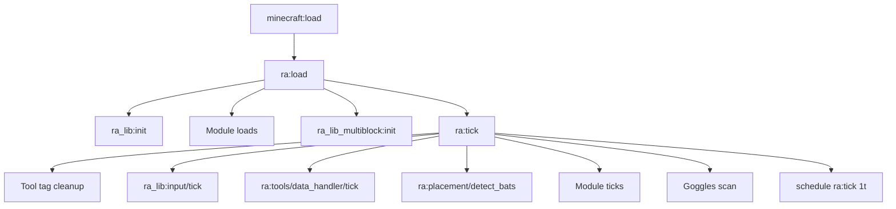
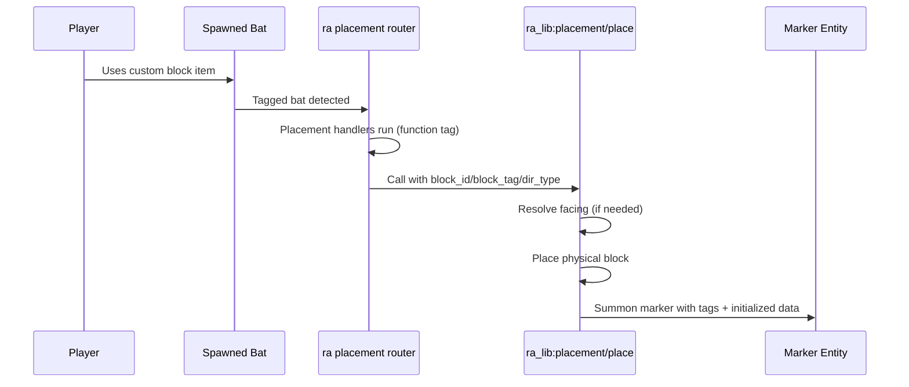
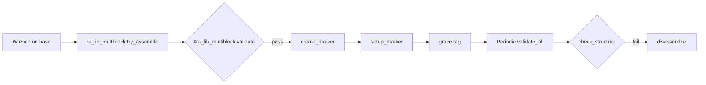

# How It Works

This page explains the runtime architecture of Redstone Additions in detail.

Use this as the canonical technical reference for the pack flow. Module pages focus on behavior and block details, while this page explains system internals.

## Runtime At A Glance

## 1) Load Pipeline

Core load entrypoint is `ra:load`.

Responsibilities:

- Creates shared scoreboards for editing and runtime bookkeeping.
- Initializes shared temporary storage `ra:temp`.
- Initializes shared libraries via `ra_lib:init`.
- Initializes gameplay namespaces (`ra_interactive`, `ra_storage`, `ra_sensors`, `ra_gates`, `ra_wireless`, `ra_wires`, `ra_chunk_loader`, `ra_multiblock`).
- Initializes multiblock library state via `ra_lib_multiblock:init`.
- Starts the recurring tick loop by calling `ra:tick`.

## 2) Tick Orchestration

`ra:tick` is scheduled every tick and acts as the orchestrator:

1. Clears stale click/active tool tags.
2. Runs modular input sessions (`ra_lib:input/tick`).
3. Runs Data Handler action/pending processing (`ra:tools/data_handler/tick`).
4. Runs placement detection (`ra:placement/detect_bats`).
5. Dispatches module ticks in fixed order.
6. Runs goggles scan (`ra:tools/goggles/tick`).
7. Re-schedules itself (`schedule function ra:tick 1t`).

This architecture keeps all state transitions deterministic and centralized.

## 3) Placement Lifecycle (Item -> Block -> Marker)

Custom blocks are represented as bat spawn egg items with custom data and placement tags.

Required item traits:

- `custom_data` marker for block type.
- `entity_data` that spawns a bat with `ra.spawned` and `ra.place.<block_id>` tags.

Placement flow:

### Handler Routing

Placement handlers are resolved through function tags, allowing each module to register block-specific `handle_placement` functions without changing core router logic.

### Marker Creation Contract

`ra_lib:placement/place` performs all generic placement work:

- Resolves orientation (for direction-sensitive blocks).
- Places physical block using helper functions.
- Summons marker entity with base tags:
  - `ra.custom_block`
  - `ra.custom_block.<id>`
  - `ra.new`
- Initializes marker data root so later writes are safe.

Callers are responsible for removing `ra.new` after first-tick initialization.

## 4) Marker State Model

Runtime block state is marker-centric.

Conventions:

- `data.properties.*`: configurable values (CDH editable).
- `data.data.*`: runtime processing state.
- `data.status.*`: status values intended for goggles/display output.

Common tags:

- `ra.custom_block`: any custom marker.
- `ra.custom_block.<id>`: typed marker classification.
- `ra.new`: one-tick setup marker.
- `ra.broken`: break cleanup queue.

This separation keeps user-edited values and transient machine state distinct.

## 5) Shared Library Responsibilities (`ra_lib`)

`ra_lib` is the generic runtime toolbox for all gameplay namespaces.

### placement/

- `place`: canonical custom-block placement helper.
- `set_block`: dispatches simple or facing-aware placement.
- `set_block_facing` and `set_block_simple`: final block placement variants.

### orientation/

- `get_facing`: computes cardinal or full 3D facing from player rotation using `dir_type`.
- `set_facing`: stores resolved facing and canonical rotation values.

### redstone/

One macro reader, `side`, knows every source once. Everything else is a way of
asking it a narrower question:

- `any`: powered at all? Stops at the first live side.
- `detect_switch`: `any`, maintaining the `ra.powered` tag. Writes no level.
- `local/{front,back,left,right,up,down}`: one named side, through the block's facing.
- `side`: one compass side.
- `detect`: all six sides plus the aggregate.
- `detect_local`: `detect` plus look-space scores and direction tags.
- `count_inputs`: how many sides carry a component at all, powered or not.
- `clear`: drops every redstone tag. Used by `detect_local` each pass, and once at
  load to sweep up tags an older version left behind.

Sources are block tags — `binary_sources`, `directional_sources`, `analog_omni`,
`analog_sources` — so a new source is a data edit, not six code edits in six
directions. That is how pressure plates came to be missing from the old reader
entirely.

Redstone output contract:

- `ra.power`: aggregate max power (`0..16`)
- world-space: `ra.power.north/south/east/west/up/down`
- look-space: `ra.power.front/back/left/right/local_up/local_down` — `detect_local` only
- `16` is reserved for superpower: a repeater, comparator or observer driving the block

Runtime usage note:

- Blocks that treat redstone as a switch call `detect_switch`; the UNI gate and the
  Teleport Anchor, which need levels, call `detect`.
- The per-source tags (`ra.powered.dust`, `.lever`, `.torch`, …) are gone. Nothing
  read them, and the reader reports a level rather than which source produced it.
- The old gate-wide signal sweep function is no longer part of active tick flow.

### inventory/

- `move_slot`: whole-slot transfer via `/item replace block ... from block ...`.
  The preferred primitive — the stack crosses verbatim, with no loot table and no
  NBT arithmetic.
- `insert_or_drop`: insert what fits, drop the rest as an item entity. Use this
  rather than `insert` for anything larger than a single item.
- `insert`: raw `loot insert`. **Destroys** whatever the destination cannot hold,
  so it is only safe with a count of 1 or behind `insert_or_drop`.
- `remove`: counted removal, any container size, handling amounts split across
  several stacks. All-or-nothing.
- `find_free_slot` / `has_free_slot` / `container_size`: slot helpers.
- `clear`: reset helper for temporary inventory storage states.

### transport/

The shared network engine used by fluids and item pipes.

- Adjacent nodes of the same class are grouped into networks by flood fill.
- Rebuilt only when a node is placed or broken, debounced to at most one rebuild
  every 5 ticks.
- Per-network amount and capacity live in scoreboards on a `net<id>` fake player;
  the medium is a readable string in `storage ra:transport`.
- `net/join`, `net/rejoin`, `net/leave`, `net/offer`, `net/take`, `net/read`.

### skin/

Draw one block's appearance over another block's mechanics, for cases where a
vanilla block carries behaviour that cannot be switched off — a dispenser firing
its own inventory on a redstone edge, for instance. `apply` / `apply_static` /
`clear`. Full rationale and caveats in the Developer Guide.

### input/

- `init`: creates input objectives and initializes session storage roots.
- `tick`: advances active sessions each tick via selected backend router.
- `poll` / `consume`: runtime API used by Data Handler pending-edit flow.

Backends:

- `trigger`: numeric input submit/validation flow.
- `writable_book`: text capture flow from temporary Input Form book.

Safety behavior:

- `give_book_safe` prevents giving books when inventory is full and emits a red warning.
- `kill_dropped_req` clears dropped request books using request-aware matching.
- cleanup/restore paths return the original held item state after text submission or cancel.

## 6) Tool Runtime

## Wrench

The only tool that **changes** a block. The goggles read, the wrench writes —
there is no second editing path, which is why the goggles no longer have a
"tinker" action.

**Shift+RMB** cycles properties, driven entirely by data:

- The block declares what it can cycle in `ra:tools/wrench/init_registry`,
  keyed by the type markers carry in `data.type`.
- Properties listed in `ra:tools/readonly/init_registry` are dropped first, so
  something the block owns can never be cycled by hand.
- What is left decides the presentation: **nothing** and it says the block does
  not cycle, **one** and it cycles immediately, **two or more** and it opens a
  menu with the current value and a `[ CYCLE ]` button per row.

Menu buttons come back through `/trigger ra.wrench`, carrying the row index plus
one — a trigger sitting at zero is indistinguishable from nobody clicking. The
target block is remembered on the player as three scores, because a chat button
is clicked some time after the menu is drawn and has no idea what it was aimed
at.

**Plain RMB** toggles the blocks that have a single on/off state worth reaching
for — the Wireless Emitter and Receiver — and runs multiblock assembly attempts
on base blocks.

Cyclers run **as the marker, at the block**, and message `@a[distance=..10]`.
The wrench never touches the player, so anything addressed to a player-side tag
would reach nobody.

## Creative Data Handler (CDH)

Property editor for marker entities:

- Detects target marker and writes targeting state to storage.
- Enumerates/edit properties through dedicated property functions.
- Uses tellraw-driven interaction menus for edit operations.

## Data Handler

- Detects nearby target marker on Shift+RMB and opens trigger-driven edit menu.
- Routes numeric and text edits through `ra_lib:input` session APIs.
- Applies consumed values back into marker `data.properties` and refreshes menu.
- Supports explicit pending-edit cancel without requiring op-level raw `/data` edits.

## Goggles

Status overlay system:

- Detects players wearing/holding goggles.
- Throttles scans on timer (every 20 ticks — one second).
- Clears old billboards each cycle.
- Collects every marker in range of any goggles wearer **once**, then draws each
  one. Drawing per player duplicated billboards when two wearers stood near the
  same block, and cost a whole-world sweep per block type per player.
- `ra:tools/goggles/draw_block` is pure routing.

Block-level rendering control:

- Each block owns its readout in `blocks/<name>/goggles.mcfunction`, next to its
  tick and placement logic.
- That function publishes the block's display name to `storage ra:temp block_name`
  first, then returns early if `storage ra:temp name_only` is set. This makes it
  the single source of the name: `ra:tools/block_name` reuses the same dispatch to
  answer the Data Handlers.
- Status lines are emitted with `prop_line` (a `data.properties` value),
  `data_line` (a `data.status` value) or `text_line` (a literal). A missing value
  renders "N/A" in red rather than disappearing.
- The stacked variants read **different** places despite the near-identical
  names: `stacked_prop_line` is `data.properties`, `stacked_status_line` is
  `data.status`, and `stacked_data_line` is `data.data` — the block's private
  working state. Asking the wrong one is silent; the value is simply absent and
  the row renders "N/A". Every readout on the Electric Furnace was blank for
  exactly that reason.

## 7) Multiblock Lifecycle (`ra_lib_multiblock`)

`ra_lib_multiblock` abstracts assembly and validity checks so `ra_multiblock` can focus on structure-specific logic.

Core functions:

- `try_assemble`: runs type validator hooks and creates marker on success.
- `create_marker`: summons centered marker and triggers setup flow.
- `setup_marker`: writes standardized typed data (`type`, `facing`, `properties`, `inputs`, `outputs`, `controls`).
- `validate_all`: periodic pass over all multiblock markers.
- `validate_single`: per-marker structure validity check.
- `disassemble`: type-specific cleanup hook and marker removal.

## 8) Namespace Boundaries

- `ra`: orchestrator, placement detection, tools, uninstall.
- `ra_lib`: shared generic systems.
- `ra_lib_multiblock`: shared multiblock runtime.
- `ra_interactive`, `ra_storage`, `ra_gates`, `ra_sensors`, `ra_wireless`, `ra_wires`, `ra_chunk_loader`: module behavior.
- `ra_multiblock`: concrete multiblock structures and base blocks.
- `ra_advancements`: progression triggers/unlocks.

## 9) Contributor Mental Model

When adding features, decide first:

1. Is this generic and reusable? Add in `ra_lib` or `ra_lib_multiblock`.
2. Is this gameplay-specific? Add in the target module namespace.
3. Does it need configuration? Store in `data.properties`.
4. Does it need user-visible diagnostics? Store in `data.status` and expose via goggles.

Keep placement tags, block IDs, recipes, and advancements consistent. Most runtime bugs in datapacks come from mismatched IDs across those files.

---

Next: [Developer Guide](developer-guide.md) for implementation workflow and extension checklists.

