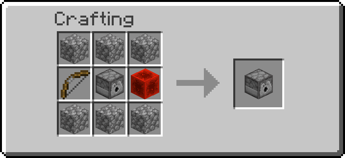
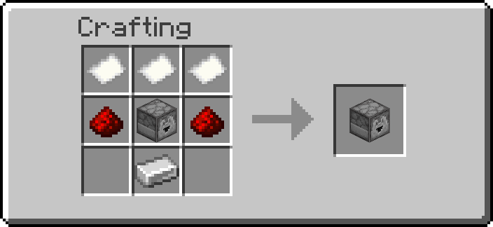
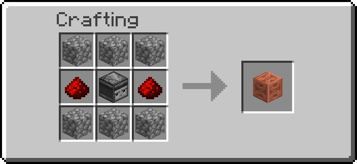
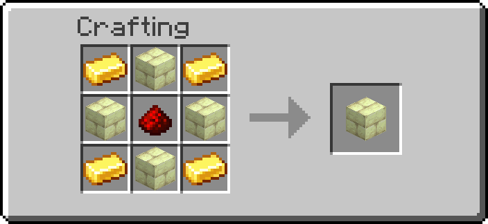
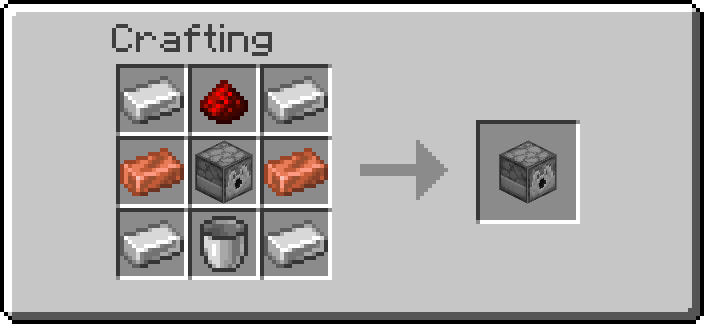
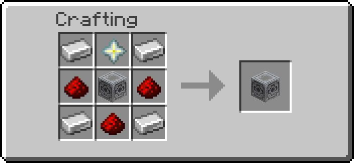
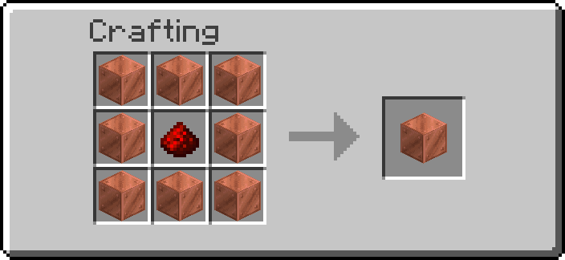
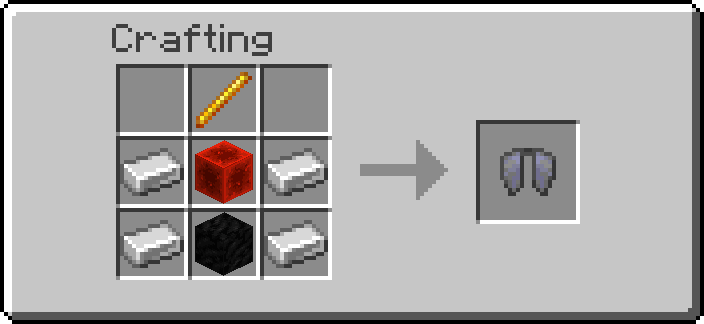
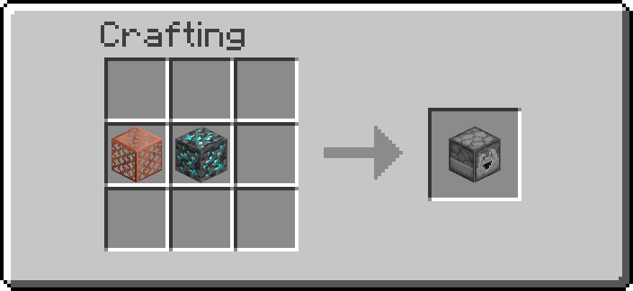
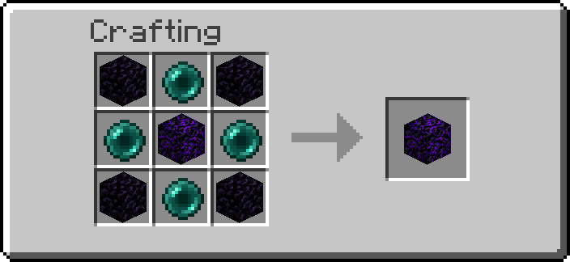

# Redstone Additions


**Version:** v5.1.15  
**Minecraft:** 1.21.9 – 26.2  
**Author:** [AnCarsenat](https://github.com/AnCarsenat)

---

Redstone Additions is a vanilla datapack with automation, storage, wireless signaling, sensors, chunk loading, multiblocks, and transport networks.

!!! tip "Player-first wiki"
    This home page is intentionally dense so most players can stay on one page and only open extra docs when they need deep technical details.

## Version Compatibility

**Supported: Minecraft 1.21.9 – 26.2** (data pack formats 88 – 107).

The pack declares and loads across that whole span. Exactly one thing inside it
genuinely changes shape: format 102 (`26.2-snapshot-3`) rewrote entity
predicates into component-map form, so `ra:is_sneaking` — which gates the
wrench's shift action (see [Tools](tools.md)) and the Redstone Remote's
channel prompt — needs both spellings. The pack ships both: the base file uses
the pre-102 form and `overlay_102/` carries the component-map form, applied
automatically from `26.2-snapshot-3` onward. Nothing else in the pack touches a
feature that broke between 88 and 107 — no `filtered` loot function, no
`contents` dynamic entry, no renamed game rules, no special crafting recipes.

Earlier versions are **not supported**, but most of the pack does not actually
need 1.21.9 — the hard floor is the `pack.mcmeta` schema. If you edit
`pack.mcmeta` to a lower `pack_format` and drop `min_format`/`max_format`, this
is what breaks and when:

| Below | What stops working |
|---|---|
| 1.21.9 | Nothing in the content itself — only the `min_format`/`max_format` fields, which that version introduced |
| 1.21.5 | Item Pipe **filters**, which identify their item frame by `block_pos` |
| 1.21.2 | Almost every item's appearance and identity (`item_model`, `consumable`, component removal) |
| 1.20.5 | Setting the Redstone Remote's channel (`copy_custom_data`) |
| 1.20.2 | Everything — the pack is built on macro functions and `return run` |

So in practice the content runs on 1.21.5+ with only the pipe filters missing,
and on 1.21.2+ in a degraded state. None of that is declared or supported.

## Quick Start

1. Download from [Modrinth](https://modrinth.com/datapack/redstone-additions) or clone from GitHub.
2. Place `redstone_additions` in your world datapacks folder.
3. Run `/reload`.
4. Run `/function ra:give_all_items` to get one prefilled bundle per namespace.

Path example:

```text
.minecraft/saves/<world>/datapacks/redstone_additions/
```

## Visual Module Atlas

**Looking for a recipe? [The Recipe Atlas](recipe-atlas.md) has all 58 of them on one
page**, listed A to Z and grouped by module — plus the four items that have no recipe
and are instead gambled for on an [enchanting table](enchant-crafting.md). This table
is the shortcut: one sample per module, and where to read about it.

| Module | What you get | Sample recipe |
|---|---|---|
| [Logic Gates](logic-gates.md) | 6 timing/logic blocks | { width="220" } |
| [Interactive Machines](interactive-machines.md) | 10 automation/utility blocks | { width="220" } |
| [Storage](storage.md) | Boxer + Unboxer workflow | { width="220" } |
| [Sensors](sensors.md) | Entity detector + tag operators | { width="220" } |
| [Wireless Redstone](wireless-redstone.md) | Emitter, Receiver, and Remote | { width="220" } |
| [Transport Networks](transport-networks.md) | Liquid, gas, EU, Boiler, Solar Panel | { width="220" } |
| [Chunk Loader](chunk-loader.md) | 1 force-load block | { width="220" } |
| [Multiblocks](multiblocks.md) | 5 base tiers + structures | { width="220" } |
| [Enchant Crafting](enchant-crafting.md) | Sacrifice items on an enchanting table | No recipe — uses the vanilla table |
| [Jetpacks](jetpacks.md) | 2 chestplate upgrade kits | { width="220" } |
| [Infinite Generators](infinite-generators.md) | 3 self-growing blocks + casing | { width="220" } |
| [Ender Links](ender-links.md) | 3 remote vaults + teleport anchor | { width="220" } |

Current pack totals:

- 52 placeable custom blocks
- 58 recipes, all of them in the [Recipe Atlas](recipe-atlas.md)
- 5 tools (Wrench, Creative Data Handler, Data Handler, Goggles, Redstone Remote)

## Commands Most Players Need

| Command | Purpose |
|---|---|
| `/function ra:give_all_items` | Full starter kit (all namespaces) |
| `/function ra_gates:items/give_all` | Logic gates bundle |
| `/function ra_interactive:items/give_all` | Interactive machines bundle |
| `/function ra_storage:items/give_all` | Boxer and Unboxer bundle |
| `/function ra_sensors:items/give_all` | Sensor bundle |
| `/function ra_wireless:items/give_all` | Wireless bundle |
| `/function ra_wires:items/give_all` | Transport/EU bundle |
| `/function ra_chunk_loader:items/give_all` | Chunk loader bundle |
| `/function ra_multiblock:blocks/give_all` | Multiblock bases |
| `/function ra_infinite:items/give_all` | Generator casing and generators |
| `/function ra_jetpacks:items/give_all` | Jetpack kits |
| `/function ra_ender:items/give_all` | Ender vaults and Teleport Anchors |
| `/function ra:uninstall` | Opens uninstall confirmation dialog |

## Tools At A Glance

| Tool | Give command | Recipe preview | Main use |
|---|---|---|---|
| Wrench | `/function ra:tools/wrench/give` | { width="200" } | Mode cycling and multiblock assembly |
| Data Handler | `/function ra:tools/data_handler/give` | { width="200" } | Edit nearby block `data.properties` |
| Goggles | `/function ra:tools/goggles/give` | { width="200" } | In-world status overlays |

## What Is New In v5.1.15

- **[Settings](settings.md).** Server settings autocomplete under
  `/function ra_settings:admin/` or open with `/function ra:settings`; players
  change their own with `/trigger ra.settings.open`. Turn blocks off, retune
  defaults, mute sounds and particles.
- **Blocks can be disabled**, with a page listing which and a warning on load.
- **Block defaults can be retuned**, and pushed onto blocks already built with
  **[Apply to placed]**.
- **Per-player sound and particle switches**, honoured by all 118 `playsound` and
  `particle` calls in the pack.
- **Uninstall asks twice** and says exactly what it is about to destroy.

### Fixed

- **Ender vaults could not find each other.** The tags a sending vault searches for
  were cleared every tick and never set — broken since v5.1.8, in all three vault
  types.
- **The Electric Furnace flickered and z-fought** while working, and a steam-fed
  EU Generator ran while drawn permanently unlit.
- **Jetpack upgrade kits fired with the jetpack off**, and on an empty tank.
- **Text input never completed** on a server without chat filtering.
- **`/trigger` completion is no longer cluttered** — nine blanket-enabled triggers
  down to one.

## What Was New In v5.1.14

- **[Recipe Atlas](recipe-atlas.md)** — every recipe on one page, searchable by name.
- **The Data Handler no longer mangles strings.** Editing a channel wrote a number,
  which is why ender vaults stopped talking to each other.
- **Blocks decide what a survival player may retune**, so a generator's period can be
  protected without taking the Clock's away.
- Registration messages go to `ra.debug` players only — and every block type sends one.
- Jetpacks count coal in your offhand; anchors work on a player's first tick.

## What Was New In v5.1.5

- **Four new modules.** [Enchant Crafting](enchant-crafting.md),
  [Jetpacks](jetpacks.md), [Infinite Generators](infinite-generators.md) and
  [Ender Links](ender-links.md).
- **Ender Links.** Vaults that join two places by channel for items, fluids and EU,
  and Teleport Anchors whose redstone strength picks which anchor you arrive at.
- **Hover flight that stops when you do.** Holding station is a servo reading your
  vertical speed rather than switching gravity off, so hover no longer feels like ice.
- **Electric runs actually carry charge.** Two bugs meant EU never got past the first
  two blocks of a wire run — a latch that was never released, and nodes handing
  charge back to whoever gave it to them.
- **Every property is editable.** The Data Handler picks its editor from the value's
  type, so a wire's transfer rate, a tank's tier and an anchor's target table can all
  be changed in game.
- **Recipe pictures are generated** from vanilla assets rather than screenshotted —
  see [Recipe Renderer](recipe-renderer.md).

## Older: v5.1.4

- **Fluid and gas rebuilt on a network model.** A connected run of pipes is one
  network with one medium; fluid no longer crawls a block per tick, and pipes cost
  nothing to keep running.
- **Boiler and Solar Panel.** Water over a heat source makes steam; steam drives
  the EU Generator, which no longer produces power from nothing. The Solar Panel
  generates EU from sky light.
- **Liquid Drain can place fluid back into the world**, so a network can carry
  lava across a base instead of only reporting a number.
- **Pumps work.** They previously only ever looked at the block to their south.
- **Item safety.** A full output container no longer destroys what will not fit,
  and the Unboxer no longer duplicates items or throws the crate on the floor.
- **Item pipe filters work**, and item pipes move whole stacks instead of one item
  at a time.
- Large performance pass across the tick loop, and a visual overhaul that removes
  z-fighting on pipes and makes wires distinguishable from pipes.

!!! note "Redstone on the Boxer and Unboxer"
    Both **run while powered**, as they always have. An earlier v5.1.4 build
    inverted this to work around a vanilla dispenser firing its own contents; the
    Unboxer became a barrel instead and the inversion was reverted before release.
    See [Storage](storage.md).

## Need More Detail

For most players, this home page plus [Block Reference](item-reference.md) is enough.

Open these pages only when needed:

- [Storage](storage.md)
- [Wireless Redstone](wireless-redstone.md)
- [How It Works](how-it-works.md)
- [Item Reference](item-reference.md)
- [Developer Guide](developer-guide.md)
- [Extension Examples](extension-examples.md)
- [Changelog](changelog.md)

## Support

- [GitHub Repository](https://github.com/AnCarsenat/Redstone-Additions)
- [Issues](https://github.com/AnCarsenat/Redstone-Additions/issues)
- [Modrinth](https://modrinth.com/datapack/redstone-additions)

