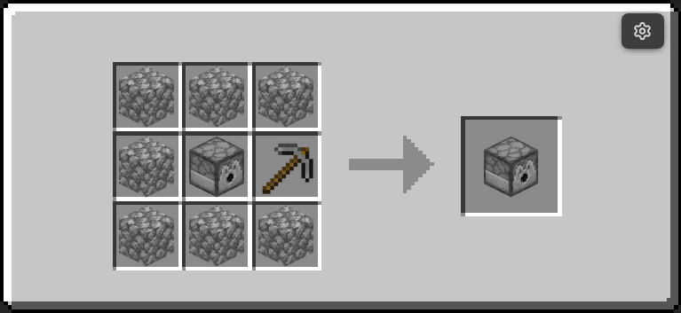
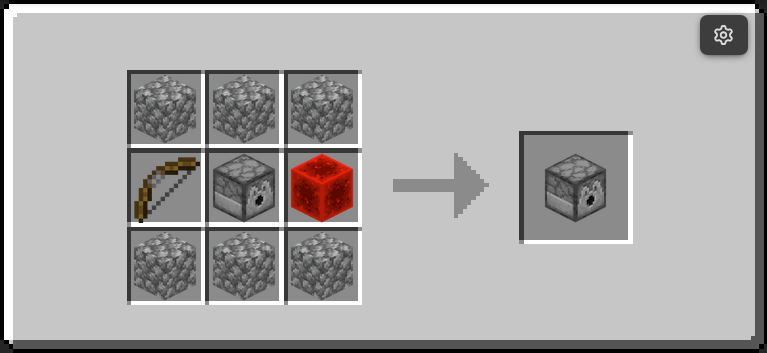
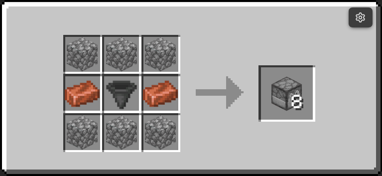
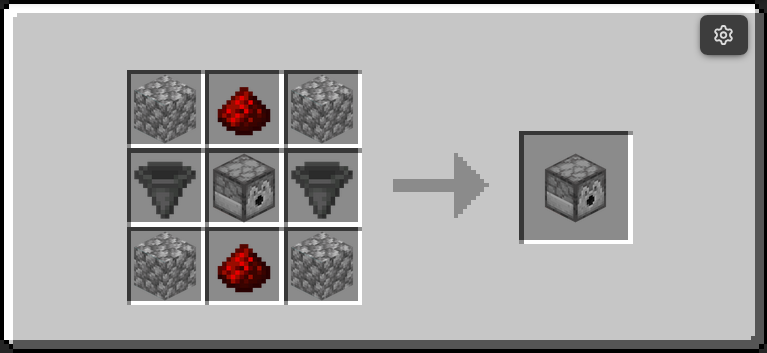
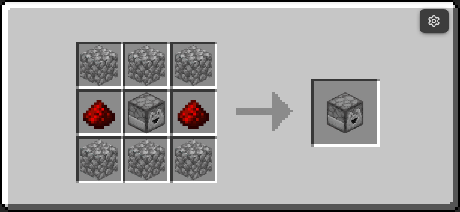
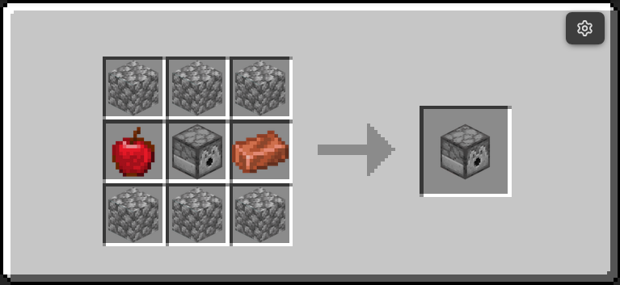
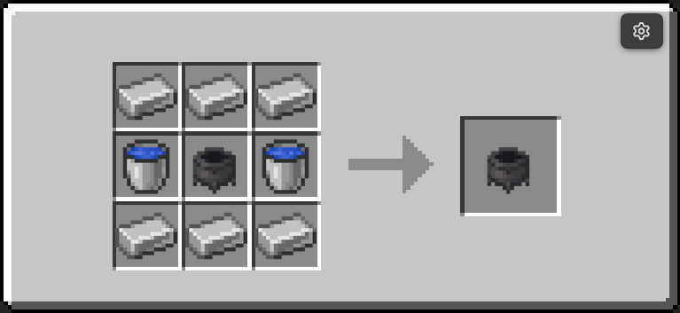
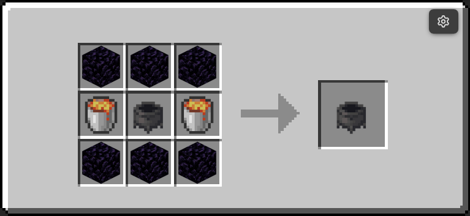
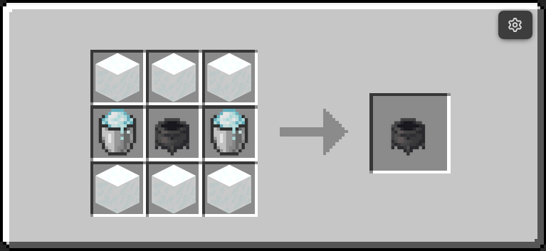
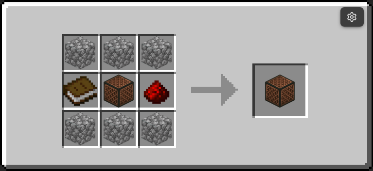

# Interactive Machines

The `ra_interactive` module provides 11 utility machines for automation and map logic.

- Namespace: `ra_interactive`
- Give all: `/function ra_interactive:items/give_all`
- Runtime architecture: [How It Works](how-it-works.md)

## Block Summary

| Block | Item model | Recipe | Trigger model | Notes |
|---|---|---|---|---|
| Block Breaker | `minecraft:dispenser` | { width="220" } | While powered | 40 tick action cooldown |
| Block Placer | `minecraft:dispenser` | { width="220" } | While powered | Places from inventory into air in front |
| Item Pipe | `minecraft:dispenser` | { width="220" } | Continuous | 4 tick transfer cycle |
| Item Mover | `minecraft:observer` | { width="220" } | Continuous | Rear container to front container |
| Spitter | `minecraft:dropper` | { width="220" } | Continuous | Throws item entities forward |
| Pusher | `minecraft:magenta_glazed_terracotta` | Yes (image pending) | While powered | Pushes entities forward, 20 tick cooldown |
| Breeder | `minecraft:dispenser` | { width="220" } | Rising edge | Uses dispenser inventory food |
| Infinite Water Cauldron | `minecraft:cauldron` | { width="220" } | Continuous | Keeps `water_cauldron[level=3]` |
| Infinite Lava Cauldron | `minecraft:cauldron` | { width="220" } | Continuous | Keeps `lava_cauldron` |
| Infinite Snow Cauldron | `minecraft:cauldron` | { width="220" } | Continuous | Keeps `powder_snow_cauldron[level=3]` |
| Message Block | `minecraft:note_block` | { width="220" } | Rising edge | Sends text to players in range |

## Behavior Notes

### Block Breaker

- Uses dispenser-facing direction.
- Breaks target block in front.
- Uses `ra.cooldown` with a 40 tick threshold.

### Block Placer

- Uses dispenser-facing direction.
- Attempts to place a valid block from its own inventory.

### Item Pipe

- Runs continuously without requiring redstone pulses.
- Moves items at a 4 tick cycle.
- Intentionally has no recipe in current release path.

### Item Mover

- Uses observer as the visual model.
- Moves one item from back inventory to front inventory each cycle.

### Spitter

- Uses dropper as visual/base block.
- Emits inventory items as entities from its facing side.

### Pusher

- Requires redstone power to activate.
- Pushes entities in front direction and then waits 20 ticks.

### Breeder

- Runs on rising-edge power only.
- Reads dispenser inventory and feeds matching nearby animals.

### Infinite Cauldrons

- Water and snow versions enforce level 3.
- Lava version enforces lava state.
- Designed to be self-healing utility sources.

### Message Block

- Internal ID uses `message_block` (placement tag and custom_data).
- Folder path remains `blocks/message`.
- Default properties initialized to message text and range.

## Contributor Notes

1. Keep machine-facing behavior tied to `dir_type` and orientation storage.
2. For inventory machines, prefer `ra_lib:inventory/insert` and `ra_lib:inventory/remove` helpers.
3. For redstone-triggered behavior, keep edge detection (`ra.was_powered`) explicit.

---
