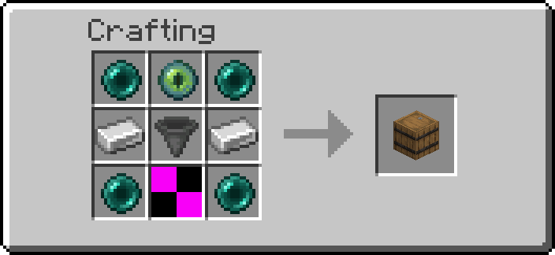
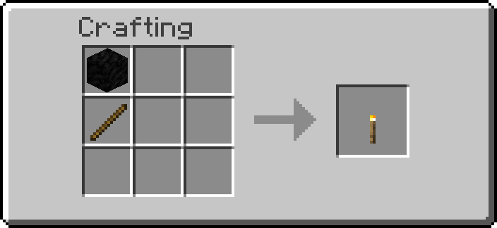

# Interactive Machines

The `ra_interactive` module provides 10 utility machines for automation and map logic.

- Namespace: `ra_interactive`
- Give all: `/function ra_interactive:items/give_all`
- Runtime architecture: [How It Works](how-it-works.md)

## Block Summary

| Block | Item model | Recipe | Trigger model | Notes |
|---|---|---|---|---|
| Block Breaker | `minecraft:dispenser` | { width="220" } | While powered | 40 tick action cooldown |
| Block Placer | `minecraft:dispenser` | { width="220" } | While powered | Places from inventory into air in front |
| Item Pipe | `minecraft:dispenser` | { width="220" } | Continuous | Moves whole stacks; filter set from your hand |
| Item Mover | `minecraft:observer` | { width="220" } | Continuous | Rear container to front container |
| Spitter | `minecraft:dropper` | { width="220" } | Continuous | Throws item entities forward |
| Breeder | `minecraft:barrel` (dispenser skin) | { width="220" } | While powered | Feeds animals from its own inventory |
| Infinite Water Cauldron | `minecraft:cauldron` | { width="220" } | Continuous | Keeps `water_cauldron[level=3]` |
| Infinite Lava Cauldron | `minecraft:cauldron` | { width="220" } | Continuous | Keeps `lava_cauldron` |
| Infinite Snow Cauldron | `minecraft:cauldron` | { width="220" } | Continuous | Keeps `powder_snow_cauldron[level=3]` |
| Magic Crate | `minecraft:barrel` | { width="220" } | Continuous | Teleports dropped items in from 5-20 blocks |
| Big Torch | `minecraft:end_rod` + torch skin | { width="220" } | Continuous | Denies hostile spawns within 1-100 blocks |
| Message Block | `minecraft:note_block` | { width="220" } | Rising edge | Sends text to players in range |

## Behavior Notes

### Block Breaker

- Uses dispenser-facing direction.
- Breaks target block in front.
- Uses `ra.cooldown` with a 40 tick threshold.

### Block Placer

- Uses dispenser-facing direction.
- Attempts to place a valid block from its own inventory.

### Item Pipe

- Runs continuously without requiring redstone pulses.
- Moves a **whole stack** at a time when the destination has a free slot, falling
  back to one item at a time to top up partial stacks.
- A **filter** is an item frame attached to any face of the pipe. Matching items
  are diverted to an adjacent container instead of going forward. The frame is
  matched by the block it is attached to, so a frame on a neighbouring block is
  never mistaken for this pipe's filter.
- If the destination is full the item stays in the pipe. Pipes apply back
  pressure rather than dropping their contents.
- Moves items at a 4 tick cycle.
- Intentionally has no recipe in current release path.

### Item Mover

- Uses observer as the visual model.
- Moves one item from back inventory to front inventory each cycle.

### Spitter

- Uses dropper as visual/base block.
- Emits inventory items as entities from its facing side.

### Breeder

Put food in it, power it, and it feeds whatever is standing in front of it.

- The block is a **barrel wearing a dispenser skin**. It used to be a real
  dispenser, which throws its own inventory on any rising redstone edge — so a
  breeder loaded with wheat scattered the wheat across the field the moment you
  powered it. A barrel is the same inventory with none of that behaviour.
- Powered by redstone directly, and it looks **one block in front** of itself for
  an adult animal that is not already in love mode.
- One item is consumed per pair bred, out of its own inventory.

#### What it will breed, and on what

Two animals of the same kind must be in front of it, both adult, and the right
food must be somewhere in the barrel.

| Animal | Feed it |
|---|---|
| Cow | `wheat` |
| Mooshroom | `wheat` |
| Sheep | `wheat` |
| Pig | `carrot`, `potato`, `beetroot` |
| Chicken | `wheat_seeds`, `melon_seeds`, `pumpkin_seeds`, `beetroot_seeds`, `torchflower_seeds`, `pitcher_pod` |
| Goat | `wheat` |
| Rabbit | `carrot`, `golden_carrot`, `dandelion` |
| Horse | `golden_apple`, `golden_carrot`, `enchanted_golden_apple` |
| Llama | `hay_block` |
| Turtle | `seagrass` |
| Panda | `bamboo` |
| Fox | `sweet_berries`, `glow_berries` |
| Bee | any flower |
| Wolf | `beef`, `chicken`, `cooked_beef`, `cooked_chicken`, `cooked_mutton`, `cooked_porkchop`, `cooked_rabbit`, `mutton`, `porkchop`, `rabbit`, `rotten_flesh` |
| Cat | `cod`, `salmon` |
| Axolotl | `tropical_fish_bucket` |
| Strider | `warped_fungus` |
| Hoglin | `crimson_fungus` |
| Camel | `cactus` |
| Sniffer | `torchflower_seeds` |
| Frog | `slime_ball` |
| Armadillo | `spider_eye` |

Bees take any flower. Wolves take any raw or cooked meat, rotten flesh included.
Chickens take any of the six seeds, and sniffers share torchflower seeds with
them — a breeder holding torchflower seeds in front of both will feed whichever
it finds first.

### Infinite Cauldrons

- Water and snow versions enforce level 3.
- Lava version enforces lava state.
- Designed to be self-healing utility sources.

### Message Block

- Internal ID uses `message_block` (placement tag and custom_data).
- Folder path remains `blocks/message`.
- Default properties initialized to message text and range.

### Item Pipe filters

A pipe's filter is `filter_item`, an item id on the pipe itself. **Shift+RMB the
pipe with the [Data Handler](tools.md#data-handler)**, then on the `filter_item`
row hold the item you want sorted and press **[Set from hand]**. Typing an id
into **[Modify]** works too.

Every pipe is placed with the field already present and empty, which is what puts
the row in the editor — the Handler draws a row only for a property the block
actually has. Empty means no filter, and everything carries on forward. An item matching the filter is pushed into whichever
container is on a side rather than carried forward; a pipe with no filter passes
everything along.

**Put the goggles on to see what a pipe is sorting.** The readout names the id and
draws the item itself above it, so a sorting wall reads at a glance without
walking up to each pipe. It is part of the goggles rather than a permanent
display on purpose: the world is not cluttered when nobody is looking, and the
item is torn down and redrawn by the goggles' own sweep instead of needing upkeep
of its own.

**This used to be an item frame stuck to the pipe.** Reading it meant selecting
every item frame within 1.6 blocks of every pipe and comparing each one's
`block_pos` against the pipe's own coordinates — an entity selector per pipe per
check, expensive enough that it had to be cached and rescanned only every 20
ticks, which meant a frame you had just hung did nothing for up to a second.
Reading a property is one `data modify` against a marker that is already the
execution context: no selector, no cache, no stale second.

Pipes built before this keep working. The migration copies the cached frame item
into `filter_item` on the first load, and leaves the frames themselves alone —
they are somebody's build, and deleting a player's item frames to tidy up after
ourselves is not a migration's business.

### Big Torch

An **end rod** wearing an oversized torch, always standing up. Every ten ticks it
sweeps for hostile mobs within `radius` and drops the ones that **spawned** there
into the void.

The end rod is the light — it gives off level 14 by itself, so the block lights
its area whether or not the display over it has rendered. The torch drawn on top
is a `block_display` scaled so it stands **one block tall** instead of the ten
sixteenths a vanilla torch manages.

It is scaled **wider** as well as taller, and that is not decoration: an end rod's
shaft is exactly as wide as a torch, so a torch drawn at its own size would share
a plane with it all the way up and z-fight. At 2.2 across it encloses the end rod
entirely — the rod is inside the torch, not behind it — with the same hundredth
of a block of clearance `ra_lib:skin/spawn` uses everywhere else in the pack.

| Property | Default | Range | Meaning |
| --- | --- | --- | --- |
| `radius` | `16` | 1–100 | How far the denial reaches |

Set the radius with the [Data Handler](tools.md#data-handler). The 100-block
ceiling is enforced in code, not just documented: `distance` describes a sphere,
so doubling the radius is eight times the volume to search. A larger value is
**written back as 100** rather than merely treated as 100, so the goggles and the
Data Handler never advertise a reach the torch does not have.

#### Spawned in versus walked in

A data pack cannot stop a spawn from happening — it can only remove what
appeared. Removing every hostile mob inside the radius would make this a mob
grinder rather than a torch, because it would also clear anything that wandered
in from outside.

So the sweep remembers every mob in a band reaching **16 blocks past** the
radius, and removes only mobs inside the radius that it has never seen. Anything
approaching on foot crosses the band first and is remembered there, so it lives.
Anything that spawns inside appears untagged and is denied on the next sweep,
with a puff of smoke where it stood.

#### Into the void, not killed

A denied mob is teleported straight down and out of the world rather than killed.
Killing one fires its death, which means drops and experience at the foot of the
torch — a Big Torch in a dark room was a passive mob farm that also lit the room.
Dropping it out of the world takes the mob without paying anybody for it.

The destination is far below any dimension in any supported version, and
deliberately not derived from the world bottom. Void damage begins some distance
under a dimension's `min_y`, and that depth is not the same across the versions
this pack supports; overshooting costs nothing, whereas tracking the number means
being wrong on whichever version nobody tested. X and Z are unchanged, so the
mob leaves through the chunk it was already standing in.

The band is sized against the sweep interval: the fastest mob covers about five
blocks in ten ticks, so nothing crosses sixteen blocks unseen.

The sweep runs every ten ticks rather than every tick because its selector
reaches as far as the radius does. A mob that exists for half a second before
being denied is indistinguishable from one that never spawned, and paying a
100-block entity selector per torch per tick to shorten that would be the most
expensive thing in the pack.

Which mobs count is the `#ra_interactive:spawn_blocked` entity type tag — the
naturally spawning hostiles. Edit the tag to change the list; no code reads a
hard-coded mob name.

### Magic Crate

A plain barrel — no skin. It wore a hopper for a while, which was a lie in two
directions: a hopper is five slots that push downwards, and this is twenty-seven
slots that pull inwards. Every `cooldown` ticks it sweeps for item entities
within `radius` and teleports them into itself.

| Property | Default | Range | Meaning |
| --- | --- | --- | --- |
| `radius` | `8` | 5–20 | How far it reaches |
| `cooldown` | `20` | 1+ | Ticks between sweeps |

The ceiling on `radius` is enforced in code, not just documented: a radius the
player could raise without limit turns one block into a server-wide entity
selector. A sweep takes at most **eight items per pulse**, so a hopper standing
over a mob farm clears the pile quickly without spiking a single tick.

Items cross as whole stacks, copied verbatim from the item entity, so names,
enchantments and damage survive. It skips items on a permanent pickup delay, and
stops when it has no completely empty slot left — the goggles read `Full` rather
than silently doing nothing. Breaking it drops all 27 slots.

## Contributor Notes

1. Keep machine-facing behavior tied to `dir_type` and orientation storage.
2. For inventory machines, prefer `ra_lib:inventory/insert` and `ra_lib:inventory/remove` helpers.
3. For redstone-triggered behavior, keep edge detection (`ra.was_powered`) explicit.

---
