# Item Reference

Namespace ids and display names, for commands and addons. If you are here to *browse*
recipes, the [Recipe Atlas](recipe-atlas.md) is the page you want: every recipe on
one page, A to Z and by module.

## Placeable Blocks

| Namespace ID                         | Display name              | Recipe |
| ------------------------------------ | ------------------------- | ------ |
| ra_gates:uni_gate                    | UNI Gate                  | 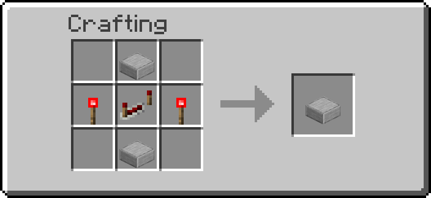{ width="220" } |
| ra_gates:clock                       | Clock                     | { width="220" } |
| ra_gates:delayer                     | Delayer                   | 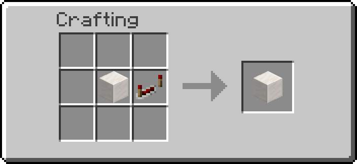{ width="220" } |
| ra_gates:extender                    | Extender                  | 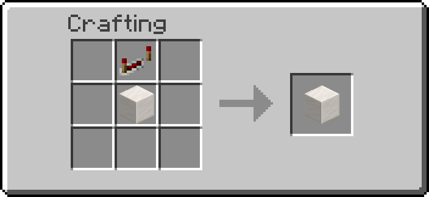{ width="220" } |
| ra_gates:randomizer                  | Randomizer                | 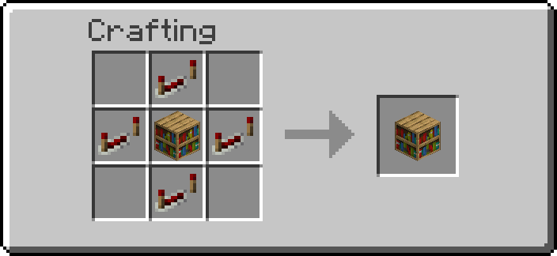{ width="220" } |
| ra_gates:shortener                   | Shortener                 | 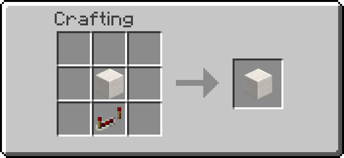{ width="220" } |
| ra_interactive:block_breaker         | Block Breaker             | 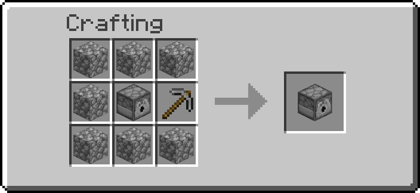{ width="220" } |
| ra_interactive:block_placer          | Block Placer              | { width="220" } |
| ra_interactive:item_pipe             | Item Pipe                 | 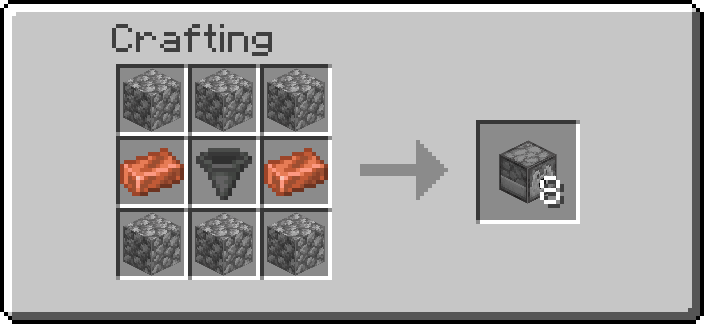{ width="220" } (recipe currently disabled) |
| ra_interactive:item_mover            | Item Mover                | 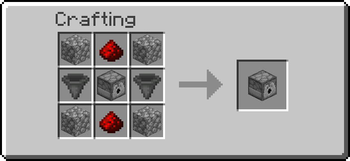{ width="220" } |
| ra_interactive:spitter               | Spitter                   | 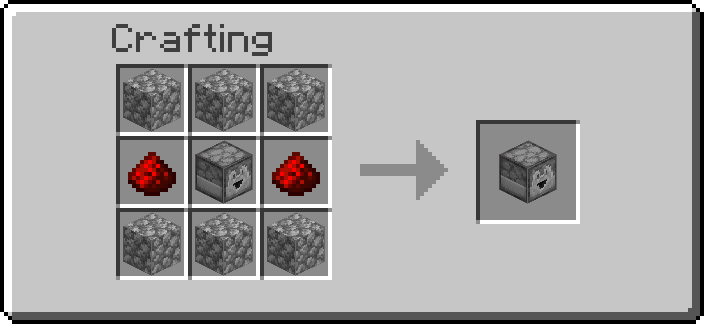{ width="220" } |
| ra_interactive:breeder               | Breeder                   | 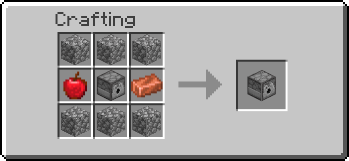{ width="220" } |
| ra_interactive:infinite_water_cauldron | Infinite Water Cauldron | 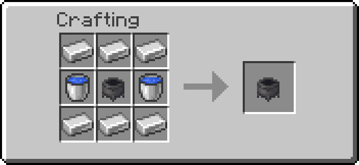{ width="220" } |
| ra_interactive:infinite_lava_cauldron | Infinite Lava Cauldron   | 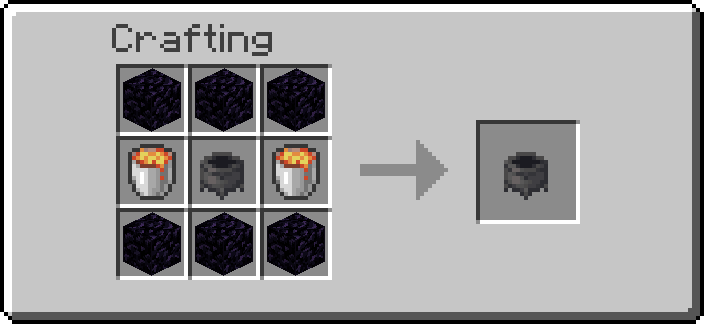{ width="220" } |
| ra_interactive:infinite_snow_cauldron | Infinite Snow Cauldron   | 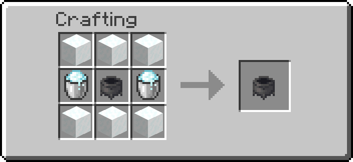{ width="220" } |
| ra_interactive:message_block         | Message Block             | 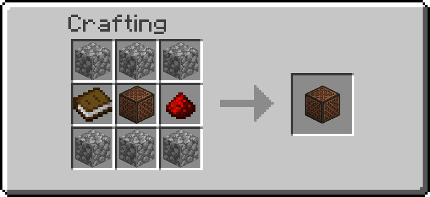{ width="220" } |
| ra_storage:boxer                     | Boxer                     | { width="220" } |
| ra_storage:unboxer                   | Unboxer                   | { width="220" } |
| ra_sensors:entity_detector           | Entity Detector           | { width="220" } |
| ra_sensors:tag_adder                 | Tag Adder                 | 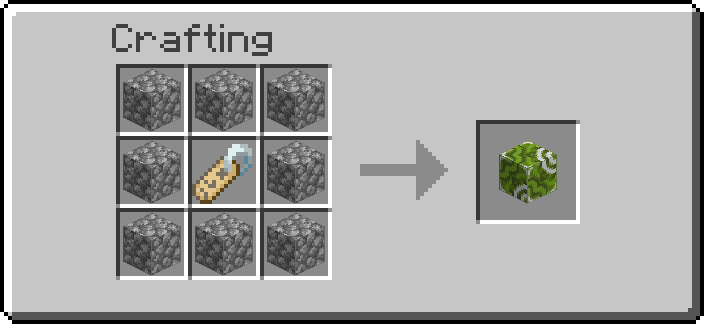{ width="220" } |
| ra_sensors:tag_remover               | Tag Remover               | 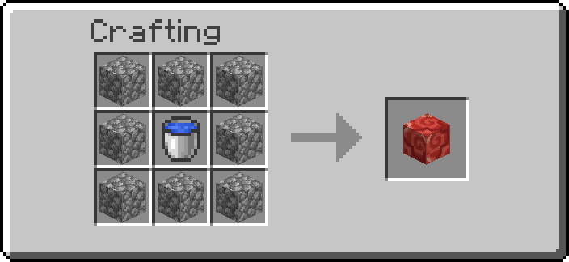{ width="220" } |
| ra_wireless:emitter                  | Wireless Emitter          | { width="220" } |
| ra_wireless:receiver                 | Wireless Receiver         | 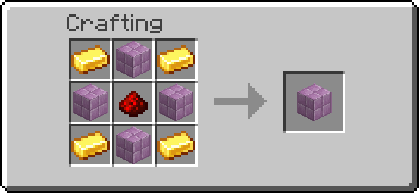{ width="220" } |
| ra_wires:liquid_pipe                 | Copper Pipe               | 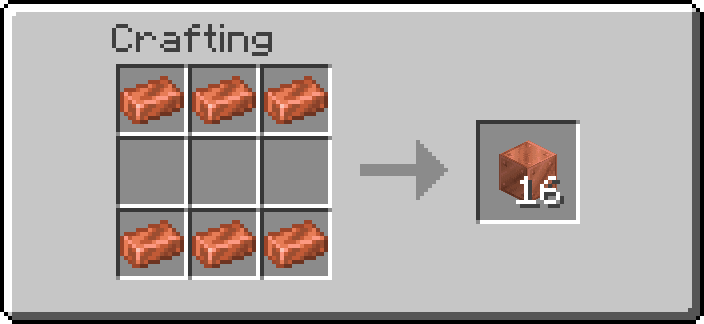{ width="220" } |
| ra_wires:liquid_tank                 | Liquid Tank               | 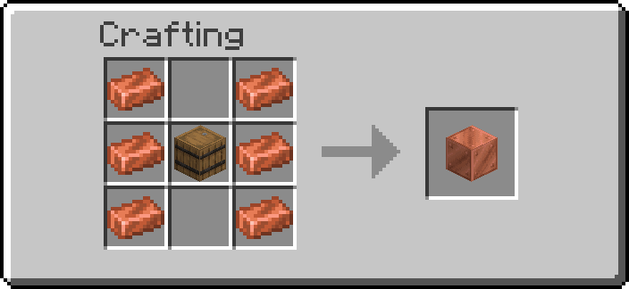{ width="220" } |
| ra_wires:liquid_pump                 | Liquid Pump               | { width="220" } |
| ra_wires:liquid_valve                | Liquid Valve              | 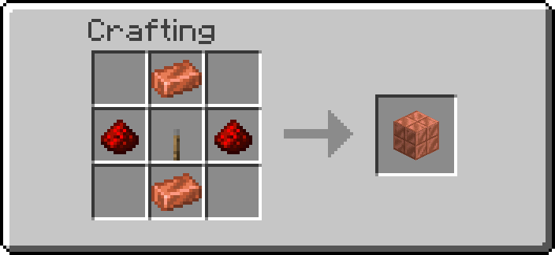{ width="220" } |
| ra_wires:liquid_drain                | Liquid Drain              | 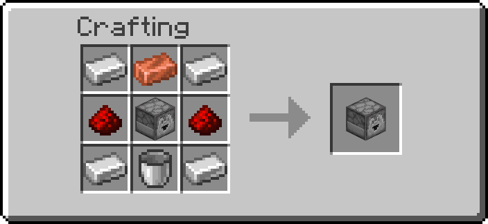{ width="220" } |
| ra_wires:gas_tank                    | Gas Tank                  | 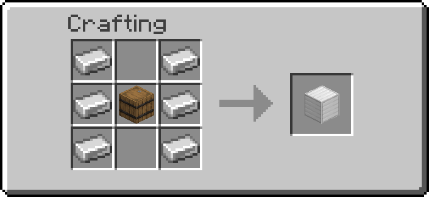{ width="220" } |
| ra_wires:gas_pump                    | Gas Pump                  | 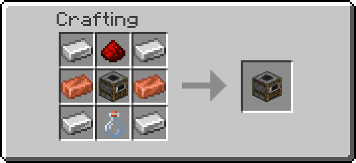{ width="220" } |
| ra_wires:gas_valve                   | Gas Valve                 | 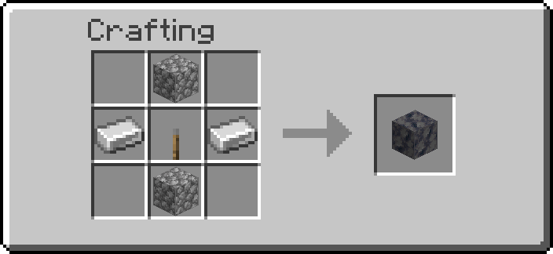{ width="220" } |
| ra_wires:electric_wire               | Wire                      | 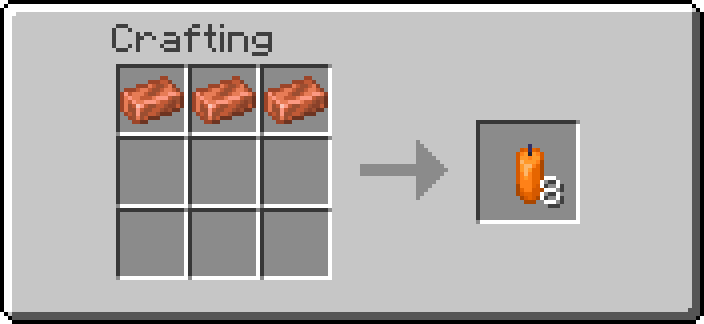{ width="220" } |
| ra_wires:electric_generator          | EU Generator (barrel)     | 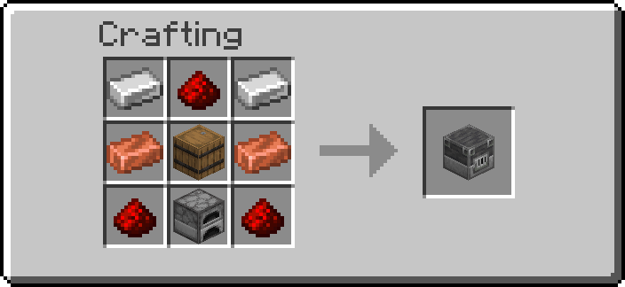{ width="220" } |
| ra_wires:electric_consumer           | EU Consumer               | 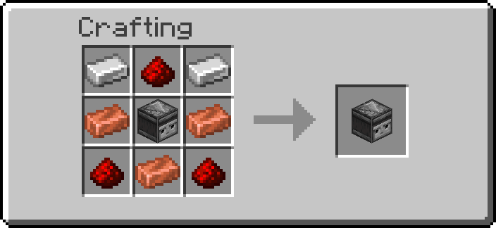{ width="220" } |
| ra_wires:electric_switch             | EU Switch                 | 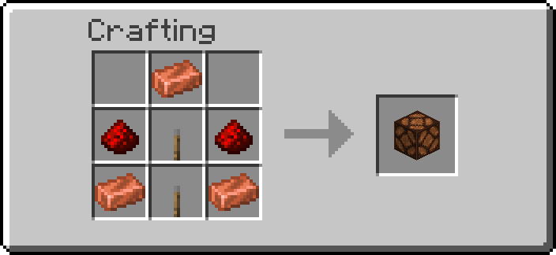{ width="220" } |
| ra_wires:boiler                      | Boiler                    | 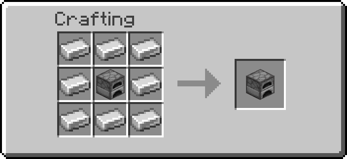{ width="220" } |
| ra_wires:solar_panel                 | Solar Panel               | 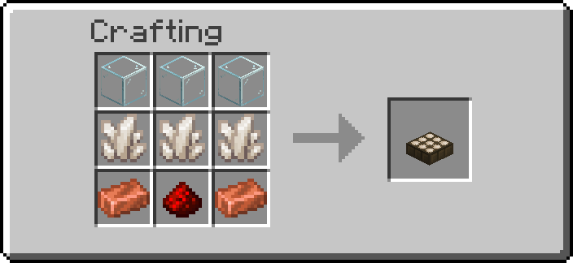{ width="220" } |
| ra_wires:battery                     | Battery                   | 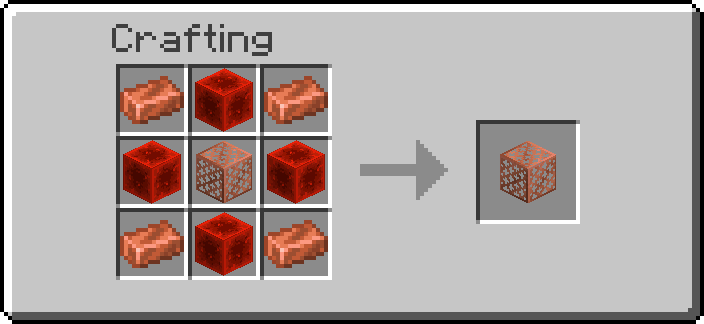{ width="220" } |
| ra_wires:electric_breaker            | EU Breaker                | 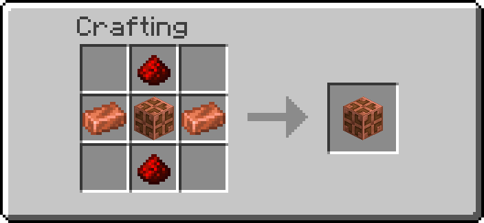{ width="220" } |
| ra_wires:industrial_light            | Industrial Light          | 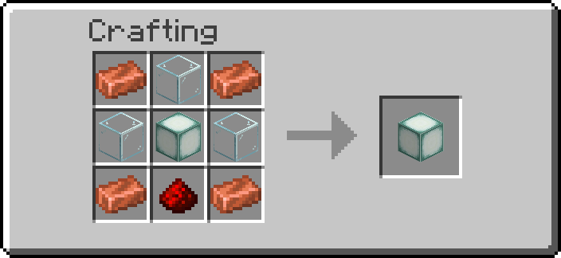{ width="220" } |
| ra_ender:ender_item_vault            | Ender Item Vault          | 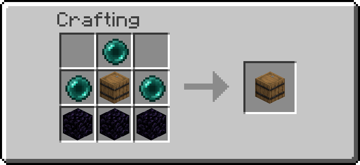{ width="220" } |
| ra_ender:ender_fluid_vault           | Ender Fluid Vault         | 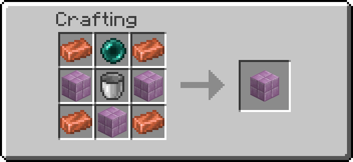{ width="220" } |
| ra_ender:ender_power_vault           | Ender Power Vault         | 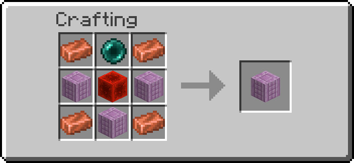{ width="220" } |
| ra_ender:teleport_anchor             | Teleport Anchor           | { width="220" } |
| ra_chunk_loader:chunk_loader         | Chunk Loader              | { width="220" } |
| ra_multiblock:copper_base            | Copper Multiblock Base    | { width="220" } |
| ra_multiblock:iron_base              | Iron Multiblock Base      | 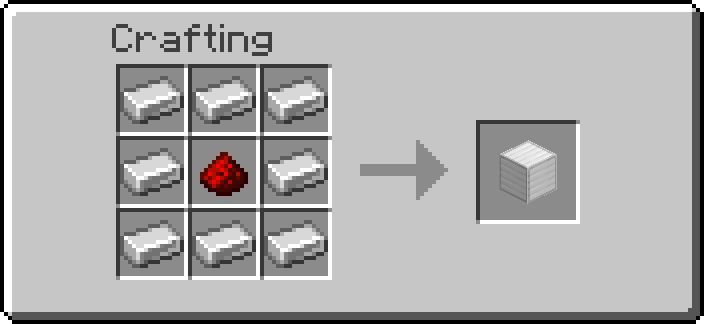{ width="220" } |
| ra_multiblock:gold_base              | Gold Multiblock Base      | 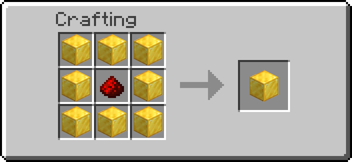{ width="220" } |
| ra_multiblock:diamond_base           | Diamond Multiblock Base   | 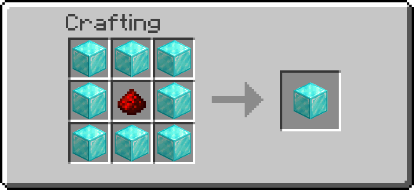{ width="220" } |
| ra_multiblock:netherite_base         | Netherite Multiblock Base | 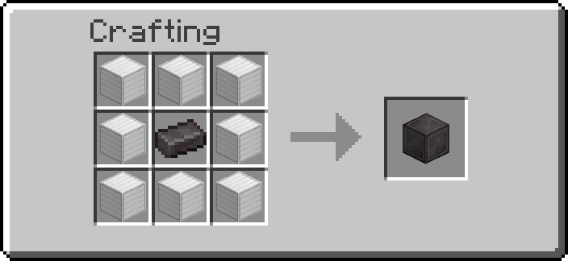{ width="220" } |
| ra_infinite:mineral_generator        | Mineral Generator         | Generator Casing + Mineral Core |
| ra_infinite:nether_generator         | Nether Generator          | Generator Casing + Nether Core |
| ra_infinite:poppy_generator          | Poppy Generator           | Generator Casing + Poppy Core |

## Crafting Items

| Namespace ID | Display name | Recipe |
| ------------ | ------------ | ------ |
| ra_infinite:generator_casing | Generator Casing | Ring of 8 `minecraft:copper_grate` around 1 `minecraft:netherite_scrap` |
| ra_infinite:mineral_core | Mineral Core | Sacrifice `minecraft:stone` on an enchanting table (1%) |
| ra_infinite:nether_core | Nether Core | Sacrifice `minecraft:netherrack` on an enchanting table (1%) |
| ra_infinite:poppy_core | Poppy Core | Sacrifice `minecraft:poppy` on an enchanting table (1%) |

The casing and cores are built on unplaceable block items — repeating command
block, jigsaw, structure block and chain command block respectively — so that
vanilla recipes, which match ingredients by id alone, can tell them apart from
each other and from ordinary materials.
| ra_jetpacks:iron_jetpack_kit | Iron Jetpack Kit | Blaze rod over iron ingots, a redstone block and a coal block |
| ra_jetpacks:infinite_jetpack_kit | Infinite Iron Jetpack Kit | Sacrifice an Iron Jetpack Kit on an enchanting table (10%) |

## Tools

| Module | Tool                  | Give function                         | Recipe         |
| ------ | --------------------- | ------------------------------------- | -------------- |
| ra     | Wrench                | `ra:tools/wrench/give`                | { width="220" } |
| ra     | Creative Data Handler | `ra:tools/creative_data_handler/give` | { width="220" } |
| ra     | Data Handler          | `ra:tools/data_handler/give`          | { width="220" } |
| ra     | Goggles               | `ra:tools/goggles/give`               | { width="220" } |
| ra     | Clipboard             | `ra:tools/clipboard/give`             | no recipe yet |
| ra     | Multimeter            | `ra:tools/multimeter/give`            | no recipe yet |

