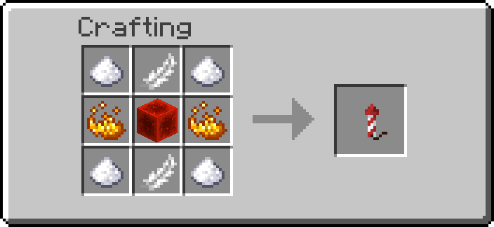
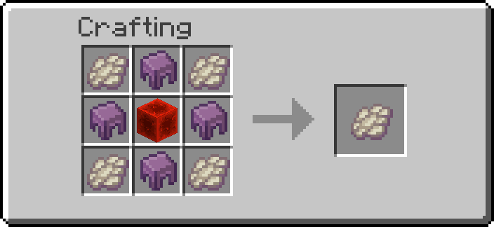
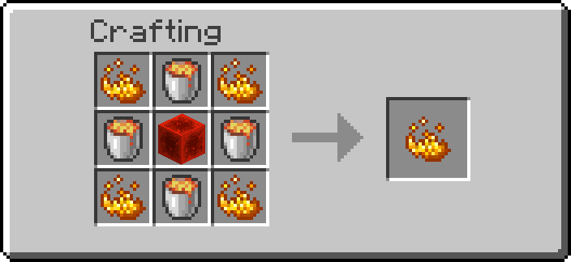
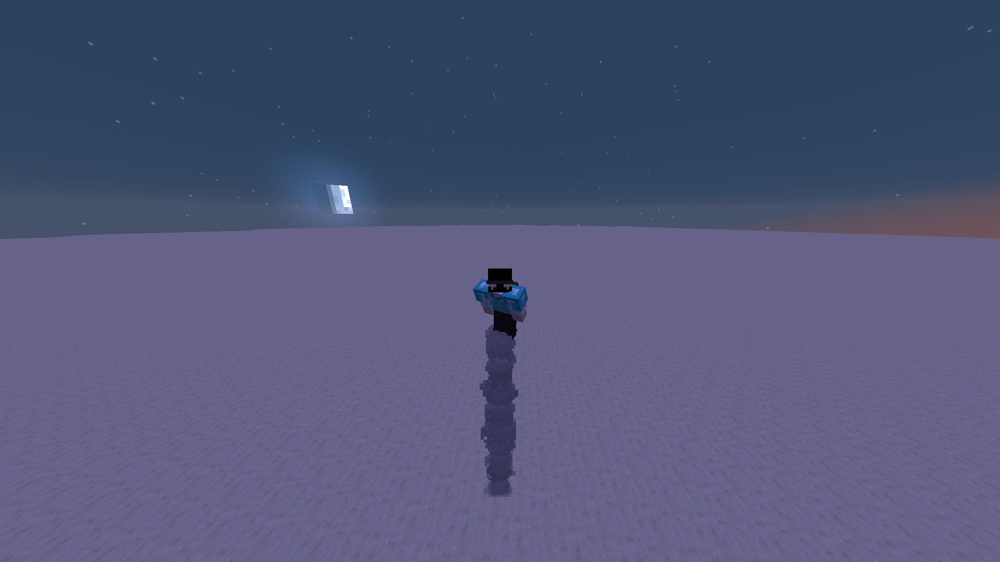

# Jetpacks

The `ra_jetpacks` module adds upgrade kits that fit onto **any** chestplate. The
chestplate keeps its material, its durability and its enchantments; the kit only
writes components onto it.

- Namespace: `ra_jetpacks`
- Give all: `/function ra_jetpacks:items/give_all`
- Mode switch: `/trigger ra.jp.mode`
- Engine sound on/off: `/trigger ra.jp.sound`
- Whole jetpack on/off: `/trigger ra.jp.power`

## Kits

| Kit | Obtained | Fuel |
| --- | -------- | ---- |
| Iron Jetpack Kit | Crafted — blaze rod, iron ingots, a redstone block and a coal block | 1 coal (or charcoal) per 2 minutes of flight |
| Infinite Iron Jetpack Kit | Sacrifice an Iron Jetpack Kit on an enchanting table, 10% per kit — see [Enchant Crafting](enchant-crafting.md) | none |

{ width="260" }

Both are `minecraft:firework_star` rendered as an elytra. Right-click while
wearing a chestplate to fit the jetpack; the kit is consumed. The iron kit
refuses to overwrite a chestplate that is already a jetpack, the infinite kit
deliberately does not — that is how you upgrade in place.

## Upgrade kits

Three further kits, right-clicked **while already wearing a jetpack**. Each is
consumed and can only be fitted once.

| Kit | Effect |
| --- | ------ |
| Thruster Kit | **Hold sprint** while airborne to accelerate horizontally, up to ~7 extra blocks/s |
| Lift Kit | Climbs at about six blocks a second instead of three, and sinks faster |
| Scorch Kit | Sets fire to anything in a 3x3 column 6 blocks under you, and hits it for 3 every 10 ticks |

!!! note "Upgrade kits only run while the jetpack does"
    Wearing a kit is not enough. In **normal** mode the jetpack only runs while you
    hold sneak, so the Thruster and Scorch do nothing unless you are sneaking —
    jumping and sprinting is not using the jetpack. In **hover** mode the jetpack
    holds you up the whole time you are airborne, so the kits run whenever you are.
    Neither works on an empty tank.

The Thruster does not use a speed attribute. `minecraft:movement_speed` governs
walking, and horizontal movement in the air runs on a much smaller air-control
factor — raising walk speed while flying raises a number that is barely read.
Instead it measures how far you actually moved last tick, feeds that into a
running average, and adds a fraction of the smoothed value back, capped per tick.
The smoothing is what stops it shaking: a single tick's delta is noisy, and
pushing straight from it made every wobble a different-sized teleport. That accelerates rather than snapping to speed, pushes
whichever way you are genuinely travelling rather than where you are looking, and
does nothing while you hover still.

It engages only while you **hold sprint**. An earlier version used a speed floor,
which never fired in classic mode at all — you fly by holding sneak there, and
horizontal air movement is a small fraction of walking speed. Sprint is an
explicit input, works the same in both modes, and nobody sprints while placing
blocks, which is where the per-tick teleport was noticeable.

{ width="220" }
{ width="220" }
{ width="220" }

Scorch only runs while genuinely airborne. "On the ground" includes standing on
the *edge* of a block, which a single sample under the player's centre gets
wrong — the centre is over the drop while the feet are still on the corner. All
four corners of the hitbox are checked, the way vanilla decides whether you fall.

Scorch excludes players, dropped items and experience orbs in its selector, and
every entity this pack owns via the `ra` tag. Armour stands, item frames and
paintings are spared by a guard inside the per-entity function rather than by the
selector, because a wrong entity type in a selector silently kills the whole
feature while a wrong one in a guard costs only that guard. That last exclusion is not tidiness:
setting `Fire` on an item entity destroys it, and every custom block in Redstone
Additions is a marker with block displays attached — without it, hovering over
your own base would burn your machines down.

Each fitted kit appends a line to the chestplate's lore, so you can see what is
on a jetpack by looking at it.

### Managing fitted kits

`/trigger ra.jp.kits` opens a menu listing the three kits and what state each is
in. Every fitted kit gets two buttons:

- **[On] / [Off]** — switch it off without removing it. Useful for Scorch, which
  you rarely want on while flying over your own farm.
- **[Remove]** — take it off the jetpack and get the kit back as an item, ready
  to fit to something else.

Being *fitted* is a property of the jetpack and travels with it. Being *switched
off* is a property of whoever is wearing it, in the same family as
`/trigger ra.jp.sound` and `/trigger ra.jp.power`. That is also the only place it
can go cheaply: fitted state is written by one generated item modifier per
reachable combination, and a separate on/off flag per kit would take that from
sixteen files to a hundred and twenty-eight.

### Where upgrades are stored

On the **chestplate**, in its `custom_data`, and listed in its lore. Hand a
jetpack to someone else and the upgrades go with it; take it off and you stop
having them.

They were briefly stored on the player instead, which was wrong in a way worth
recording. An item modifier is a static JSON file: it cannot read what is already
on the item, and `set_components` replaces a component whole rather than merging
into it, so "add the Scorch flag" is not expressible. That made player tags look
like the only option — but the consequence was that upgrades followed you onto a
different chestplate, survived losing the jetpack, and made every kit report
itself already fitted after the first one.

The answer is to not merge. Read the chestplate's whole state, work out the new
whole state, write that. Every reachable state has its own generated modifier:
two tiers times eight upgrade combinations, chosen by pasting a three-bit number
into the modifier's name. Adding a fourth kit doubles the count, which is the
honest price of the item being the record.

The flight code re-derives `ra.jp.kit_*` tags from the worn chestplate every
tick, so those tags are a cache rather than state — which is also what heals a
world where they were stored on the player.

## Flight modes

Switch with `/trigger ra.jp.mode`. The mode is per player, not per jetpack.

### Classic

Hold sneak to rise, three blocks a second. Smoke, flame and the engine loop just
below your feet once you are off the ground, and gravity behaves normally the moment
you let go — which is why classic never feels floaty.

### Hover

| Holding station | Sneak to steer |
|---|---|
|  |  |

The jetpack carries your weight while the chestplate is worn — let go of
everything and you hang in the air, on the spot.

| Input | Result |
| ----- | ------ |
| Sneak + look up (pitch ≤ -30) | Rise, three blocks a second |
| Sneak + look down (pitch ≥ 30) | Sink — gravity is handed back with slow falling on top, so the descent is capped and costs no fall damage |
| Sneak + look level | Hold |
| No sneak | Hold |
| Standing on a block | Thrusters idle, vanilla physics |
| Touching down after a flight | Jetpack switches itself off |

A block under the feet (`unless block ~ ~-0.1 ~ #minecraft:air`) means the
thrusters have nothing to hold up, so they stop: walking around with gravity
switched off feels wrong. Sneak plus look up is exempt from that check, which is
how you lift off in the first place.

**Landing** is different from standing. Once the player has actually been airborne
— tracked in `ra.jp.air` — touching down runs the same function
`/trigger ra.jp.power` runs: gravity back, action bar, click. Flight resumes when
you ask for it, not by accident. Standing there deliberately does *not* switch the
jetpack off; an earlier version did, and it turned itself off the tick after hover
was selected, so there was never an armed jetpack to take off with.

The dead zone between -30 and +30 is wide on purpose: a narrow one flipped state
every time you glanced around, and each flip resets your velocity.

The thrusters wash campfire smoke downward the whole time hover is on — they are
holding your weight even when you are standing still — and throw out more of it,
harder, whenever you are climbing or sinking. No end rods: white streaks read as
glitched geometry rather than exhaust.

Sinking is deliberately *not* levitation. The amplifier-255 trick that used to
read back as `-1` no longer wraps — the amplifier is stored as an integer, so 255
means 255 and throws the player upward at about twelve blocks a second. That was
the "look down, shoot up" bug.

### Holding station is a servo

Zero gravity on its own is what made hover feel like ice: nothing damps vertical
motion except vanilla's 2%-per-tick drag, so releasing sneak left you coasting
for well over a second. There is no command that clears a player's velocity
either — an in-place `/tp` used to, but [MC-275455](https://mojira.dev/MC-275455)
was fixed in the 1.21.2 snapshots and relative teleports now keep motion, so that
whole trick is dead.

So hold measures speed and pushes back. Each tick the player's `Pos[1]` is
sampled into `ra.jp.y`, the difference is vertical speed in thousandths of a
block per tick, and the gravity attribute is aimed against it:

| Vertical speed | Gravity applied | Effect |
| -------------- | --------------- | ------ |
| within ±0.006 b/t | `0` | free hover, dead zone |
| ±0.006 to ±0.06 b/t | `∓0.02` | gentle correction |
| beyond ±0.06 b/t | `∓0.08` | full thruster |

Player gravity has a base of `0.08`, so an `add_value` of `-0.08` is exactly
zero, `-0.16` is a full upward thruster and `0.0` leaves gravity untouched. A
levitation coast is 0.15 b/t and dies in two ticks; the dead zone keeps the
tiers from flapping, so there is no visible bob. The modifier is only rewritten
when the tier changes.

Climbing skips the servo — levitation sets velocity itself.

Horizontal movement still feels lighter than walking, and that part is vanilla:
airborne players accelerate at a flat 0.02 no matter what their speed attribute
says, and hover keeps you permanently airborne.

Gravity comes back as soon as the chestplate comes off, the mode is switched, or
the jetpack runs out of fuel.

## Fuel

Only the iron tier burns anything, and only on ticks where the jetpack is holding
the player's weight: classic thrust, and hover holding or climbing. Sinking in
hover mode is free. After 2400 such ticks one `minecraft:coal` is taken from the
inventory, falling back to `minecraft:charcoal`.

With neither in the inventory the jetpack cuts out: gravity returns, an action
bar message says so, and it stays off until you pick up coal again.

## Engine sound

The engine is `minecraft:item.elytra.flying` at volume 0.35, pitch 0.6, replayed
once a second. One sound, one volume — hovering, climbing, sinking and classic
thrust all sound the same, because in every one of them the thrusters are carrying
the player.

It runs while the jetpack is holding you up and stops the moment it isn't:

| Path | Engine |
| ---- | ------ |
| Hover, airborne (hold, climb, sink) | running |
| Hover, feet on a block | stopped |
| Classic, sneaking and airborne | running |
| Classic, sneak released | stopped |
| Chestplate off, out of fuel, switched off, muted | stopped |

Two functions, and that is the whole logic: `flight/sound` keeps the loop alive,
`flight/sound_off` kills it. The sample is long, so `sound_off` runs `stopsound` —
without it the last copy played on for seconds after the jetpack cut out, which is
why classic kept humming after sneak was released. `sound` also stops before every
replay, so copies never stack. `ra.jp.sound_on` marks that a loop is playing, so
`sound_off` is a no-op when nothing is.

`stopsound` covers everyone within 20 blocks, since they are the ones being played
to; two players flying together can clip each other's loop for a moment before it is
replayed.

`/trigger ra.jp.sound` mutes and unmutes it per player. The particles stay.

## Switching the jetpack off

`/trigger ra.jp.power` disables the jetpack outright for that player: no hover, no
sneak thrust, no fuel burn, no particles, no sound, in either mode. Gravity comes
back the same tick. The chestplate keeps its components, so nothing has to be
re-fitted — run the trigger again and flight is back. Useful when you want to
sneak for the ordinary reasons.

## Sneaking speed

Both modes fly by holding sneak, and sneaking normally costs 70% of walking
speed. A worn jetpack adds `0.7` to `minecraft:sneaking_speed` (base `0.3`),
which puts crouch movement back at full walking pace for as long as the
chestplate is on. The modifier is `ra.jetpack.sneak`, removed the moment the
jetpack comes off.

## Scoreboards and tags

| Name | Meaning |
| ---- | ------- |
| `ra.jp.mode` | Trigger objective players use to request a mode switch |
| `ra.jp.sound` | Trigger objective for muting the engine loop |
| `ra.jp.mute` | `1` while that player's engine loop is muted |
| `ra.jp.power` | Trigger objective for the master switch |
| `ra.jp.off` | `1` while that player's jetpack is switched off |
| `ra.jp.snd` | Engine-loop timer, one play a second |
| `ra.jp.sound_on` | An engine loop is currently playing |
| `ra.jp.air` | `1` once the player has left the ground, so a landing can be spotted |
| `ra.jp.y` | Last sampled Y, in thousandths of a block |
| `ra.jp.grav` | Thruster tier currently written onto the gravity attribute |
| `ra.jp.state` | `0` classic, `1` hover |
| `ra.jp.fuel` | Ticks of powered flight since the last coal |
| `ra.jetpack_on` | Player is currently wearing a jetpack |
| `ra.jp.hover_on` | The gravity modifier is applied |
| `ra.jp.dry` | Out of fuel; flight is suspended |
| `ra.jp.speed_on` | The sneaking-speed modifier is applied |

The gravity modifier is `ra.jetpack.hover` on `minecraft:gravity`, always
`add_value`, rewritten by `ra_jetpacks:flight/gravity` when the thruster tier
changes. Base player gravity is `0.08`, so the values run from `-0.16` (full
thrust up) through `-0.08` (weightless) to `0.0` (vanilla fall). Do not reach for
`add_multiplied_total`: an earlier version used `-1.0` there to hit zero, which
works but cannot express a thruster at all.
