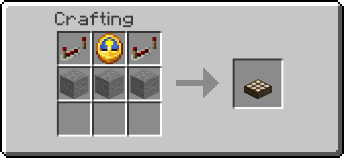

# Markdown to BBCode

`tools/md_to_bbcode.py` turns a Markdown file into the BBCode Planet Minecraft
accepts, so the pack's description on PMC can be generated from `readme.md`
instead of retyped by hand every release.

Pure standard library — no install step, no dependencies.

## Quick commands

Run from `redstone_additions/`.

```bash
# readme.md -> readme.bbcode, next to the input
python3 tools/md_to_bbcode.py ../readme.md \
    --base-url https://github.com/AnCarsenat/Redstone-Additions/raw/main/

# straight to the terminal, ready to pipe into a clipboard tool
python3 tools/md_to_bbcode.py ../docs/jetpacks.md -o - --quiet | wl-copy

# a docs page, with its relative pictures pointed at the published site
python3 tools/md_to_bbcode.py ../docs/storage.md \
    --base-url https://ancarsenat.github.io/Redstone-Additions/ -o /tmp/storage.bbcode

# tables as aligned monospace text instead of flattened lists
python3 tools/md_to_bbcode.py ../readme.md --tables code

# drop the shields.io badges, keep everything else
python3 tools/md_to_bbcode.py ../readme.md --no-badges

# from stdin
cat ../readme.md | python3 tools/md_to_bbcode.py - > /tmp/out.bbcode
```

The repo's own PMC description lives in `readme.bbcode` at the repo root,
regenerated from `readme.md` with the first command above.

| Flag | Meaning |
| ---- | ------- |
| `-o <file>` | output path, `-` for stdout; default is the input named `.bbcode` |
| `--base-url <url>` | absolute URL that relative links and pictures hang off |
| `--tables list\|code\|drop` | how to flatten tables, default `list` |
| `--inline-code bold\|italic\|code\|backticks` | what `` `code` `` becomes, default `bold` |
| `--images auto\|img\|simg` | `auto` keeps the source's width as `[img width=.. height=..]`; `img` drops every size; `simg` scales to the post width |
| `--source-dir <dir>` | where the picture files live, for reading the height that goes with a width; default is the input file's directory |
| `--heading-sizes H1,..,H6` | PMC font sizes per heading level, default `24,18,14,12,12,12` |
| `--no-badges` | drop shields.io-style badge pictures |
| `--no-youtube` | keep YouTube links as links instead of `[yt]` embeds |
| `--quiet` | do not report on stderr what was flattened |

## What PMC's BBCode has

The tag set is the one PMC's own site guide lists, plus the member mention its
embed boxes emit:

`[b] [i] [u] [s] [size=n] [color=x] [center] [hr] [list] [list=1] [*] [img]
[img width=w height=h] [simg] [url] [url=x] [quote] [code] [spoiler]
[spoiler=Title] [yt] [mn=id]`

Two things follow from that list:

- **`[size=n]` takes a pixel number**, not the 1–6 scale other boards use. PMC's
  editor writes `6, 8, 10, 12, 14, 18, 24, 36`, where `12` is body text.
  `--heading-sizes` only accepts those numbers.
- **There is no heading tag and no table tag.** Headings become sized bold text
  and tables get flattened; see below.

## The mapping

| Markdown | BBCode |
| -------- | ------ |
| `# heading` … `###### heading` | `[size=24][b]…[/b][/size]`, down to plain `[b]…[/b]` |
| `**bold**`, `*italic*`, `~~struck~~` | `[b]`, `[i]`, `[s]` |
| `` `code` `` | `[b]code[/b]` by default — `[code]` is a box, not inline |
| ```` ```fenced``` ```` | `[code]…[/code]`, language tag dropped |
| `- item` / `1. item` | `[list][*]item[/list]` / `[list=1]…[/list]` |
| `> quoted` | `[quote]…[/quote]` |
| `---` | `[hr]` |
| `[text](url)` | `[url=url]text[/url]` |
| `` | `[img]url[/img]`, alt text dropped |
| `{ width="220" }` | `[img width=220 height=101]url[/img]` — see [Picture sizes](#picture-sizes) |
| a YouTube link | `[yt]video_id[/yt]` |
| `<p align="center">` | `[center]…[/center]` |
| `<details><summary>T</summary>` | `[spoiler=T]…[/spoiler]` |
| `!!! note "Title"` | `[quote][b]Title[/b] …[/quote]` |
| `??? note "Title"` | `[spoiler=Title]…[/spoiler]` |
| `| a | b |` | a flattened list — labelled blocks if the row holds a picture, or aligned text in `[code]` |

Raw HTML is read properly rather than stripped — these all map onto their BBCode
equivalent, which matters for `readme.md`, whose header block is nothing else:

```html
b  strong  i  em  u  ins  s  del  strike  br  hr  a  img  center
p  div  h1..h6  ul  ol  li  blockquote  code  pre  details  summary
span style="font-weight|font-style|text-decoration|color"
```

`align="center"` and `style="text-align:center"` become `[center]` on any of the
block tags.

## Tables

`--tables list` (the default) turns each row into a list item:

```
| Command   | Purpose      |     [list]
|-----------|--------------|  →  [*][b]/function ra:give_all_items[/b] — One bundle per namespace
| `/function ra:give_all_items` | One bundle per namespace |     [/list]
```

A row of three or more columns becomes a bold first cell with a nested list of
`header: value` lines.

**A table holding pictures skips the list entirely.** A picture inside a `[*]`
item wraps around the bullet on PMC and leaves the row's text pinned to the
bottom of the picture, so those tables are written as labelled blocks instead —
the module previews in `readme.md` are one of these:

```
[b]Logic Gates[/b]
[img width=220 height=101]…/clock.png[/img]

[b]Interactive Machines[/b]
[img width=220 height=101]…/block_placer.png[/img]
```

`--tables code` keeps the grid, padded to line up inside `[code]` — good for a
table of plain text, useless for one holding pictures. `--tables drop` throws
them away and says how many rows went.

## Picture sizes

PMC sizes a picture on the tag itself:

```
[center][img width=200 height=200]https://example.com/icon.png[/img][/center]
```

So a `width="128"` in the readme's HTML, or a `{ width="220" }` on a docs page,
carries straight through. Markdown only ever gives a width, and a width alone
would squash the picture, so the tool reads the **height out of the image file**
and writes both:

```
{ width="220" }
  ↓ clock.png is 704x324
[img width=220 height=101]…/clock.png[/img]
```

The file is found relative to the input file, or — for an absolute URL that
starts with `--base-url` — relative to the same directory. `--source-dir` points
that lookup somewhere else. PNG, GIF and JPEG headers are read directly, so there
is no Pillow dependency. If the file cannot be found, the width is written on its
own and the missing height is reported on stderr.

A picture with no size in the source stays a plain `[img]` at its own pixels —
that is what the badges want. `--images img` drops every size; `--images simg`
ignores them and scales everything to the post width instead.

## Line breaks

PMC turns **every newline into a line break**. Markdown does not — a wrapped
paragraph is one paragraph, and the line endings in the file are invisible. So
soft wraps are joined back into one line on the way out, or the description would
break wherever the source file happened to wrap. Markdown's own hard break — two
spaces at the end of a line, or a trailing backslash — is kept.

## Known losses

The tool reports each of these on stderr unless `--quiet` is passed.

- **Anchor links** (`[text](#section)`) come out as plain text. PMC has no
  in-page anchors, so the target is worthless.
- **Relative links and pictures** are left as written unless `--base-url` is
  given, and PMC will not resolve them. Always pass `--base-url` for `readme.md`.
- **Image alt text** is dropped — `[img]` has nowhere to put it.
- **A width with no findable file** is written without its height, which lets PMC
  stretch the picture. See [Picture sizes](#picture-sizes).
- **Mermaid diagrams** stay inside `[code]` as their source text; PMC will not
  draw them. Use a rendered picture in the PMC copy instead.
- **HTML tables** are flattened to lines, not aligned.

## Updating the PMC page

1. Edit `readme.md` as usual.
2. `python3 tools/md_to_bbcode.py ../readme.md --base-url https://github.com/AnCarsenat/Redstone-Additions/raw/main/`
3. Paste `readme.bbcode` into the PMC submission's description field with
   **BBCode mode on**, and preview before saving — PMC turns every newline into
   a line break, so the preview is the only real check.
