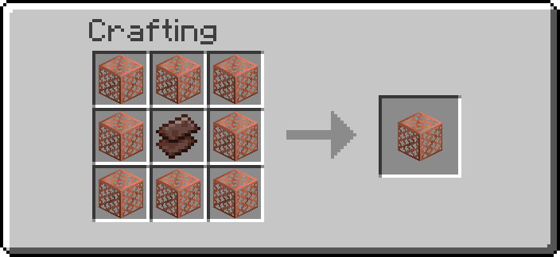
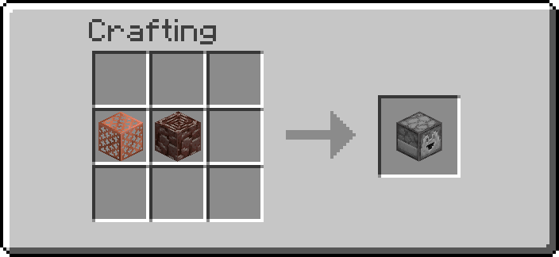
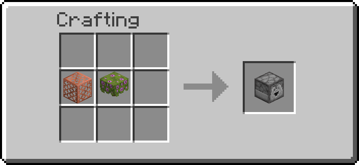
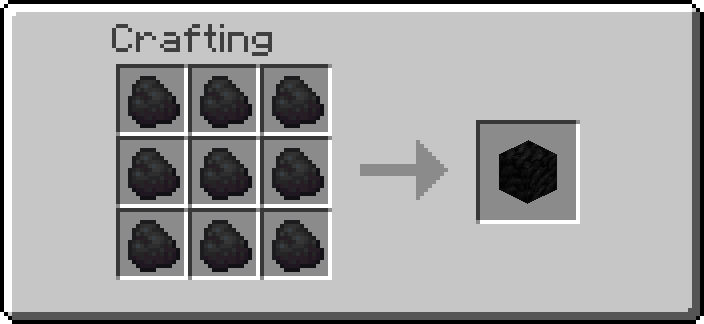
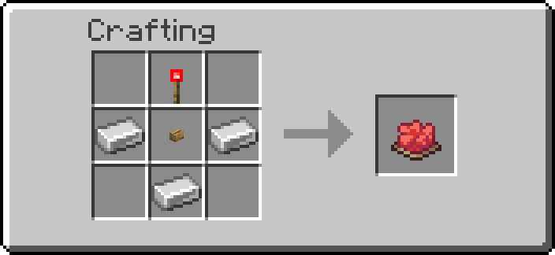

# Recipe Atlas

Every recipe in the pack, in one place: 68 of them.

!!! tip "Finding one"
    Use the search box with the item's name — every recipe below is indexed by
    it. The table right underneath is the same list alphabetically, and each
    module section links to the page explaining what those blocks do.

This page is generated by `tools/recipe_render/render.py --atlas`, so it lists
what the pack actually contains rather than what someone remembered to add.

## Every item, A to Z

| Item | Module | Station |
| ---- | ------ | ------- |
| [Battery](#transport-networks) | [Transport Networks](transport-networks.md) | Crafting table |
| [Big Torch](#interactive-machines) | [Interactive Machines](interactive-machines.md) | Crafting table |
| [Block Breaker](#interactive-machines) | [Interactive Machines](interactive-machines.md) | Crafting table |
| [Block Placer](#interactive-machines) | [Interactive Machines](interactive-machines.md) | Crafting table |
| [Boiler](#transport-networks) | [Transport Networks](transport-networks.md) | Crafting table |
| [Boxer](#storage) | [Storage](storage.md) | Crafting table |
| [Breeder](#interactive-machines) | [Interactive Machines](interactive-machines.md) | Crafting table |
| [Chunk Loader](#chunk-loader) | [Chunk Loader](chunk-loader.md) | Crafting table |
| [Clipboard](#tools) | [Tools](index.md) | Crafting table |
| [Clock](#logic-gates) | [Logic Gates](logic-gates.md) | Crafting table |
| [Copper Multiblock Base](#multiblocks) | [Multiblocks](multiblocks.md) | Crafting table |
| [Copper Pipe](#transport-networks) | [Transport Networks](transport-networks.md) | Crafting table |
| [Data Handler](#tools) | [Tools](index.md) | Crafting table |
| [Delayer](#logic-gates) | [Logic Gates](logic-gates.md) | Crafting table |
| [Diamond Multiblock Base](#multiblocks) | [Multiblocks](multiblocks.md) | Crafting table |
| [Electric Furnace](#transport-networks) | [Transport Networks](transport-networks.md) | Crafting table |
| [Enchanted Coal](#not-crafted-won-on-an-enchanting-table) | [Interactive Machines](interactive-machines.md) | Enchanting table |
| [Enchanted Coal Block](#interactive-machines) | [Interactive Machines](interactive-machines.md) | Crafting table |
| [Ender Fluid Vault](#ender-links) | [Ender Links](ender-links.md) | Crafting table |
| [Ender Item Vault](#ender-links) | [Ender Links](ender-links.md) | Crafting table |
| [Ender Power Vault](#ender-links) | [Ender Links](ender-links.md) | Crafting table |
| [Entity Detector](#sensors) | [Sensors](sensors.md) | Crafting table |
| [EU Breaker](#transport-networks) | [Transport Networks](transport-networks.md) | Crafting table |
| [EU Consumer](#transport-networks) | [Transport Networks](transport-networks.md) | Crafting table |
| [EU Generator](#transport-networks) | [Transport Networks](transport-networks.md) | Crafting table |
| [EU Switch](#transport-networks) | [Transport Networks](transport-networks.md) | Crafting table |
| [Extender](#logic-gates) | [Logic Gates](logic-gates.md) | Crafting table |
| [Gas Pump](#transport-networks) | [Transport Networks](transport-networks.md) | Crafting table |
| [Gas Tank](#transport-networks) | [Transport Networks](transport-networks.md) | Crafting table |
| [Gas Valve](#transport-networks) | [Transport Networks](transport-networks.md) | Crafting table |
| [Generator Casing](#infinite-generators) | [Infinite Generators](infinite-generators.md) | Crafting table |
| [Goggles](#tools) | [Tools](index.md) | Crafting table |
| [Gold Multiblock Base](#multiblocks) | [Multiblocks](multiblocks.md) | Crafting table |
| [Industrial Light](#transport-networks) | [Transport Networks](transport-networks.md) | Crafting table |
| [Infinite Iron Jetpack Kit](#not-crafted-won-on-an-enchanting-table) | [Jetpacks](jetpacks.md) | Enchanting table |
| [Infinite Lava Cauldron](#interactive-machines) | [Interactive Machines](interactive-machines.md) | Crafting table |
| [Infinite Snow Cauldron](#interactive-machines) | [Interactive Machines](interactive-machines.md) | Crafting table |
| [Infinite Water Cauldron](#interactive-machines) | [Interactive Machines](interactive-machines.md) | Crafting table |
| [Iron Jetpack Kit](#jetpacks) | [Jetpacks](jetpacks.md) | Crafting table |
| [Iron Multiblock Base](#multiblocks) | [Multiblocks](multiblocks.md) | Crafting table |
| [Item Mover](#interactive-machines) | [Interactive Machines](interactive-machines.md) | Crafting table |
| [Item Pipe](#interactive-machines) | [Interactive Machines](interactive-machines.md) | Crafting table |
| [Lift Kit](#jetpacks) | [Jetpacks](jetpacks.md) | Crafting table |
| [Liquid Drain](#transport-networks) | [Transport Networks](transport-networks.md) | Crafting table |
| [Liquid Pump](#transport-networks) | [Transport Networks](transport-networks.md) | Crafting table |
| [Liquid Tank](#transport-networks) | [Transport Networks](transport-networks.md) | Crafting table |
| [Liquid Valve](#transport-networks) | [Transport Networks](transport-networks.md) | Crafting table |
| [Magic Crate](#interactive-machines) | [Interactive Machines](interactive-machines.md) | Crafting table |
| [Message Block](#interactive-machines) | [Interactive Machines](interactive-machines.md) | Crafting table |
| [Mineral Core](#not-crafted-won-on-an-enchanting-table) | [Infinite Generators](infinite-generators.md) | Enchanting table |
| [Mineral Generator](#infinite-generators) | [Infinite Generators](infinite-generators.md) | Crafting table, shapeless |
| [Multimeter](#tools) | [Tools](index.md) | Crafting table |
| [Nether Core](#not-crafted-won-on-an-enchanting-table) | [Infinite Generators](infinite-generators.md) | Enchanting table |
| [Nether Generator](#infinite-generators) | [Infinite Generators](infinite-generators.md) | Crafting table, shapeless |
| [Netherite Multiblock Base](#multiblocks) | [Multiblocks](multiblocks.md) | Crafting table |
| [Poppy Core](#not-crafted-won-on-an-enchanting-table) | [Infinite Generators](infinite-generators.md) | Enchanting table |
| [Poppy Generator](#infinite-generators) | [Infinite Generators](infinite-generators.md) | Crafting table, shapeless |
| [Randomizer](#logic-gates) | [Logic Gates](logic-gates.md) | Crafting table |
| [Redstone Remote](#wireless-redstone) | [Wireless Redstone](wireless-redstone.md) | Crafting table |
| [Scorch Kit](#jetpacks) | [Jetpacks](jetpacks.md) | Crafting table |
| [Shortener](#logic-gates) | [Logic Gates](logic-gates.md) | Crafting table |
| [Solar Panel](#transport-networks) | [Transport Networks](transport-networks.md) | Crafting table |
| [Spitter](#interactive-machines) | [Interactive Machines](interactive-machines.md) | Crafting table |
| [Tag Adder](#sensors) | [Sensors](sensors.md) | Crafting table |
| [Tag Remover](#sensors) | [Sensors](sensors.md) | Crafting table |
| [Teleport Anchor](#ender-links) | [Ender Links](ender-links.md) | Crafting table |
| [Thruster Kit](#jetpacks) | [Jetpacks](jetpacks.md) | Crafting table |
| [Unboxer](#storage) | [Storage](storage.md) | Crafting table |
| [UNI Gate](#logic-gates) | [Logic Gates](logic-gates.md) | Crafting table |
| [Wire](#transport-networks) | [Transport Networks](transport-networks.md) | Crafting table |
| [Wireless Emitter](#wireless-redstone) | [Wireless Redstone](wireless-redstone.md) | Crafting table |
| [Wireless Receiver](#wireless-redstone) | [Wireless Redstone](wireless-redstone.md) | Crafting table |
| [Wrench](#tools) | [Tools](index.md) | Crafting table |

## Chunk Loader

Module page: [Chunk Loader](chunk-loader.md) — give everything: `/function ra_chunk_loader:items/give_all`

| Item | Recipe | Station | Namespace id |
| ---- | ------ | ------- | ------------ |
| **Chunk Loader** | { width="220" } | Crafting table | `ra_chunk_loader:chunk_loader` |

## Ender Links

Module page: [Ender Links](ender-links.md) — give everything: `/function ra_ender:items/give_all`

| Item | Recipe | Station | Namespace id |
| ---- | ------ | ------- | ------------ |
| **Ender Fluid Vault** | { width="220" } | Crafting table | `ra_ender:ender_fluid_vault` |
| **Ender Item Vault** | { width="220" } | Crafting table | `ra_ender:ender_item_vault` |
| **Ender Power Vault** | { width="220" } | Crafting table | `ra_ender:ender_power_vault` |
| **Teleport Anchor** | { width="220" } | Crafting table | `ra_ender:teleport_anchor` |

## Infinite Generators

Module page: [Infinite Generators](infinite-generators.md) — give everything: `/function ra_infinite:items/give_all`

| Item | Recipe | Station | Namespace id |
| ---- | ------ | ------- | ------------ |
| **Generator Casing** | { width="220" } | Crafting table | `ra_infinite:generator_casing` |
| **Mineral Generator** | { width="220" } | Crafting table, shapeless | `ra_infinite:mineral_generator` |
| **Nether Generator** | { width="220" } | Crafting table, shapeless | `ra_infinite:nether_generator` |
| **Poppy Generator** | { width="220" } | Crafting table, shapeless | `ra_infinite:poppy_generator` |

## Interactive Machines

Module page: [Interactive Machines](interactive-machines.md) — give everything: `/function ra_interactive:items/give_all`

| Item | Recipe | Station | Namespace id |
| ---- | ------ | ------- | ------------ |
| **Big Torch** | { width="220" } | Crafting table | `ra_interactive:big_torch` |
| **Block Breaker** | { width="220" } | Crafting table | `ra_interactive:block_breaker` |
| **Block Placer** | { width="220" } | Crafting table | `ra_interactive:block_placer` |
| **Breeder** | { width="220" } | Crafting table | `ra_interactive:breeder` |
| **Enchanted Coal Block** | { width="220" } | Crafting table | `ra_interactive:enchanted_coal_block` |
| **Infinite Lava Cauldron** | { width="220" } | Crafting table | `ra_interactive:infinite_lava_cauldron` |
| **Infinite Snow Cauldron** | { width="220" } | Crafting table | `ra_interactive:infinite_snow_cauldron` |
| **Infinite Water Cauldron** | { width="220" } | Crafting table | `ra_interactive:infinite_water_cauldron` |
| **Item Mover** | { width="220" } | Crafting table | `ra_interactive:item_mover` |
| **Item Pipe** | { width="220" } | Crafting table | `ra_interactive:item_pipe` |
| **Magic Crate** | { width="220" } | Crafting table | `ra_interactive:magic_crate` |
| **Message Block** | { width="220" } | Crafting table | `ra_interactive:message_block` |
| **Spitter** | { width="220" } | Crafting table | `ra_interactive:spitter` |

## Jetpacks

Module page: [Jetpacks](jetpacks.md) — give everything: `/function ra_jetpacks:items/give_all`

| Item | Recipe | Station | Namespace id |
| ---- | ------ | ------- | ------------ |
| **Iron Jetpack Kit** | { width="220" } | Crafting table | `ra_jetpacks:iron_jetpack_kit` |
| **Lift Kit** | { width="220" } | Crafting table | `ra_jetpacks:lift_kit` |
| **Scorch Kit** | { width="220" } | Crafting table | `ra_jetpacks:scorch_kit` |
| **Thruster Kit** | { width="220" } | Crafting table | `ra_jetpacks:speed_kit` |

## Logic Gates

Module page: [Logic Gates](logic-gates.md) — give everything: `/function ra_gates:items/give_all`

| Item | Recipe | Station | Namespace id |
| ---- | ------ | ------- | ------------ |
| **Clock** | { width="220" } | Crafting table | `ra_gates:clock` |
| **Delayer** | { width="220" } | Crafting table | `ra_gates:delayer` |
| **Extender** | { width="220" } | Crafting table | `ra_gates:extender` |
| **Randomizer** | { width="220" } | Crafting table | `ra_gates:randomizer` |
| **Shortener** | { width="220" } | Crafting table | `ra_gates:shortener` |
| **UNI Gate** | { width="220" } | Crafting table | `ra_gates:uni_gate` |

## Multiblocks

Module page: [Multiblocks](multiblocks.md) — give everything: `/function ra_multiblock:blocks/give_all`

| Item | Recipe | Station | Namespace id |
| ---- | ------ | ------- | ------------ |
| **Copper Multiblock Base** | { width="220" } | Crafting table | `ra_multiblock:copper_base` |
| **Diamond Multiblock Base** | { width="220" } | Crafting table | `ra_multiblock:diamond_base` |
| **Gold Multiblock Base** | { width="220" } | Crafting table | `ra_multiblock:gold_base` |
| **Iron Multiblock Base** | { width="220" } | Crafting table | `ra_multiblock:iron_base` |
| **Netherite Multiblock Base** | { width="220" } | Crafting table | `ra_multiblock:netherite_base` |

## Sensors

Module page: [Sensors](sensors.md) — give everything: `/function ra_sensors:items/give_all`

| Item | Recipe | Station | Namespace id |
| ---- | ------ | ------- | ------------ |
| **Entity Detector** | { width="220" } | Crafting table | `ra_sensors:entity_detector` |
| **Tag Adder** | { width="220" } | Crafting table | `ra_sensors:tag_adder` |
| **Tag Remover** | { width="220" } | Crafting table | `ra_sensors:tag_remover` |

## Storage

Module page: [Storage](storage.md) — give everything: `/function ra_storage:items/give_all`

| Item | Recipe | Station | Namespace id |
| ---- | ------ | ------- | ------------ |
| **Boxer** | { width="220" } | Crafting table | `ra_storage:boxer` |
| **Unboxer** | { width="220" } | Crafting table | `ra_storage:unboxer` |

## Tools

Module page: [Tools](index.md) — give everything: `/function ra:tools/give_all`

| Item | Recipe | Station | Namespace id |
| ---- | ------ | ------- | ------------ |
| **Clipboard** | { width="220" } | Crafting table | `ra:clipboard` |
| **Data Handler** | { width="220" } | Crafting table | `ra:data_handler` |
| **Goggles** | { width="220" } | Crafting table | `ra:goggles` |
| **Multimeter** | { width="220" } | Crafting table | `ra:multimeter` |
| **Wrench** | { width="220" } | Crafting table | `ra:wrench` |

## Transport Networks

Module page: [Transport Networks](transport-networks.md) — give everything: `/function ra_wires:items/give_all`

| Item | Recipe | Station | Namespace id |
| ---- | ------ | ------- | ------------ |
| **Battery** | { width="220" } | Crafting table | `ra_wires:battery` |
| **Boiler** | { width="220" } | Crafting table | `ra_wires:boiler` |
| **Copper Pipe** | { width="220" } | Crafting table | `ra_wires:liquid_pipe_copper` |
| **Electric Furnace** | { width="220" } | Crafting table | `ra_wires:electric_furnace` |
| **EU Breaker** | { width="220" } | Crafting table | `ra_wires:electric_breaker` |
| **EU Consumer** | { width="220" } | Crafting table | `ra_wires:electric_consumer` |
| **EU Generator** | { width="220" } | Crafting table | `ra_wires:electric_generator` |
| **EU Switch** | { width="220" } | Crafting table | `ra_wires:electric_switch` |
| **Gas Pump** | { width="220" } | Crafting table | `ra_wires:gas_pump` |
| **Gas Tank** | { width="220" } | Crafting table | `ra_wires:gas_tank` |
| **Gas Valve** | { width="220" } | Crafting table | `ra_wires:gas_valve` |
| **Industrial Light** | { width="220" } | Crafting table | `ra_wires:industrial_light` |
| **Liquid Drain** | { width="220" } | Crafting table | `ra_wires:liquid_drain` |
| **Liquid Pump** | { width="220" } | Crafting table | `ra_wires:liquid_pump` |
| **Liquid Tank** | { width="220" } | Crafting table | `ra_wires:liquid_tank` |
| **Liquid Valve** | { width="220" } | Crafting table | `ra_wires:liquid_valve` |
| **Solar Panel** | { width="220" } | Crafting table | `ra_wires:solar_panel` |
| **Wire** | { width="220" } | Crafting table | `ra_wires:electric_wire_copper` |

## Wireless Redstone

Module page: [Wireless Redstone](wireless-redstone.md) — give everything: `/function ra_wireless:items/give_all`

| Item | Recipe | Station | Namespace id |
| ---- | ------ | ------- | ------------ |
| **Redstone Remote** | { width="220" } | Crafting table | `ra_wireless:remote` |
| **Wireless Emitter** | { width="220" } | Crafting table | `ra_wireless:emitter` |
| **Wireless Receiver** | { width="220" } | Crafting table | `ra_wireless:receiver` |

## Not crafted — won on an enchanting table

These have no recipe. Drop the item on top of a plain enchanting table and
each one rolls: a hit becomes the upgrade, a miss is destroyed. One item a
second, so a stack of 64 is 64 separate rolls. Full explanation on
[Enchant Crafting](enchant-crafting.md).

| Sacrifice | Becomes | Chance | Module |
| --------- | ------- | ------ | ------ |
| Coal | **Enchanted Coal** | 1% | [Interactive Machines](interactive-machines.md) |
| Iron Jetpack Kit | **Infinite Iron Jetpack Kit** | 10% | [Jetpacks](jetpacks.md) |
| Stone | **Mineral Core** | 1% | [Infinite Generators](infinite-generators.md) |
| Netherrack | **Nether Core** | 1% | [Infinite Generators](infinite-generators.md) |
| Poppy | **Poppy Core** | 1% | [Infinite Generators](infinite-generators.md) |
