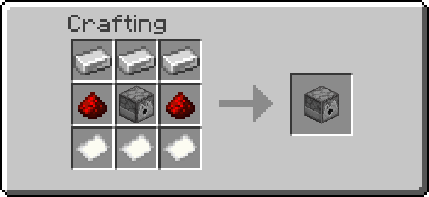

# Storage

The `ra_storage` module adds Boxer, Unboxer, and Item Crate workflows for compact inventory transport.

- Namespace: `ra_storage`
- Give all: `/function ra_storage:items/give_all`
- Give crate only: `/function ra_storage:items/give_storage_box`
- Runtime architecture: [How It Works](how-it-works.md)

## Block Summary

| Block   | Item model            | Recipe                                                                  | Default I/O                            |
| ------- | --------------------- | ----------------------------------------------------------------------- | -------------------------------------- |
| Boxer   | `minecraft:dropper`   | { width="220" }     | `input1="^ ^ ^-1"`, `output1="^ ^ ^1"` |
| Unboxer | `minecraft:dispenser` | { width="220" } | `input1="^ ^ ^-1"`, `output1="^ ^ ^1"`   |

## Item Crates

Item Crates are storage items (`storage_box.json`) and can also be given directly.
They are made by a Boxer and emptied by an Unboxer.

- Base item: `minecraft:player_head` with profile `BoxMan01234`
- Stack size: `64`
- Storage payload keys:
  - `components.minecraft:custom_data.ra.storage_box.items`
  - `components.minecraft:custom_data.ra.storage_box.preview`
- Marker key for modern crates: `components.minecraft:custom_data.ra.item_box`
- Lore displays the first five preview lines; if more exist, lore appends `... and more`

## Two-Minute Setup

1. Place a Boxer and point its front toward an output container.
2. Put the source container behind the Boxer (default `input1`) and ensure output has free space.
3. Power the Boxer. It packs the full input container into one Item Crate and inserts that crate into `output1`.
4. Place an Unboxer facing an output container.
5. Put one or more Item Crates **inside the Unboxer itself** (it is a barrel — open it and drop them in).
6. Power the Unboxer. It empties each crate completely into `output1` and consumes the crate.

## Runtime Behavior

### Boxer

1. Runs while powered.
2. Requires both `input1` and `output1` to be valid `#ra_lib:containers`.
3. Copies the full `Items` list from `input1` into one Item Crate (`ra.storage_box.items`).
4. Builds a preview list and refreshes crate lore.
5. Inserts the generated crate into `output1` using shared item-mover capacity checks.
6. Clears input container contents only after successful insertion.
7. Enforces a hopper-like minimum 4 tick cooldown between successful operations.

### Unboxer

1. Runs while powered.
2. Selects one candidate crate from `input1`, which defaults to the Unboxer's own inventory.
3. Accepts both modern crates (`ra.item_box`) and legacy crates (`ra.storage_box_item`).
4. Empties the crate **completely** in one activation, taking each stored stack out before delivering it.
5. If `output1` cannot hold a stack, the remainder is **dropped as an item** rather than destroyed.
6. Destroys the spent crate, which also clears the way for the next one in the container.
7. Enforces a hopper-like minimum 4 tick cooldown between successful operations.

## Command Quick Reference

| Command | Purpose |
|---|---|
| `/function ra_storage:items/give_all` | Give Boxer, Unboxer, and Item Crate |
| `/function ra_storage:items/give_storage_box` | Give one empty Item Crate |
| `/function ra:items/bundles/give_storage_bundle` | Give a prefilled storage bundle |

## Troubleshooting

- Boxer or Unboxer does nothing: verify it is powered and that `input1`/`output1` point to valid containers.
- Boxer does not clear input: output likely cannot accept another item (full container).
- Unboxer does nothing: ensure the selected input item is an Item Crate with at least one stored stack.
- Items on the floor near the Unboxer: the output was full. Contents are dropped rather than deleted.

!!! warning "Changed in v5.1.4"
    The Unboxer is now a **barrel**, not a dispenser. It holds the crates it is
    unboxing in its own inventory, and a vanilla dispenser fires its own contents
    on any rising redstone edge — which is what threw crates on the floor
    part-way through. A barrel has the same inventory and GUI and cannot dispense.
    Redstone control is unchanged: power it to run.

## Contributor Notes

1. Keep modern (`ra.item_box`) and legacy (`ra.storage_box_item`) crate compatibility paths intact.
2. Take from the crate **before** inserting, and deliver with `ra_lib:inventory/insert_or_drop`. Inserting first and consuming afterwards duplicates items; a plain `loot insert` destroys the overflow.
3. If lore or preview format changes, update both `update_lore` and `update_lore_storage_target`.

---
