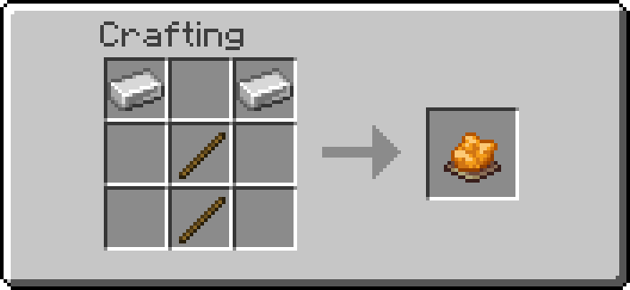
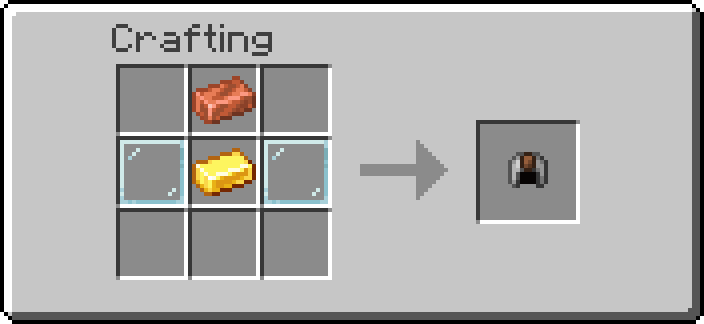
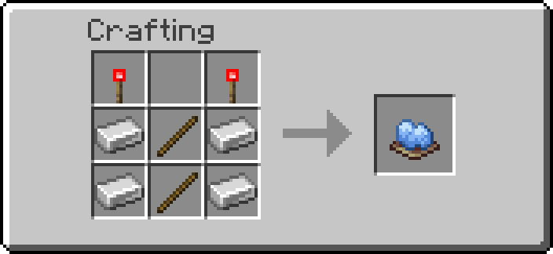
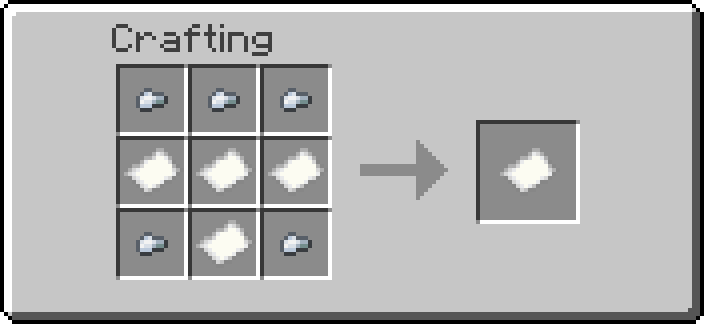
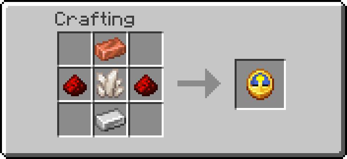

# Tools

Five items. Each one does exactly one job, and they do not overlap — the split
matters, because for a while two of them could both change a block and there was
no rule about which owned what.

| Tool | Item | Job | Recipe |
| --- | --- | --- | --- |
| Wrench | `blaze_rod`, orange dye model | The only tool that **changes** a block | { width="200" } |
| Goggles | `leather_helmet`, dyed orange | **Reads** every block in range, continuously | { width="200" } |
| Data Handler | `blaze_rod`, light blue dye model | Edits one block's properties in detail | { width="200" } |
| Clipboard | `paper` | Copies one block's settings onto others | { width="200" } |
| Multimeter | `clock` | Reads a network's numbers into chat | { width="200" } |

---

## Wrench

**Shift+RMB** a block to cycle its settings.

What happens depends on how many settings the block has:

- **None** — it says so.
- **One** — it cycles immediately. A menu with one button is a worse button.
- **Two or more** — it opens a menu listing each setting, its current value, and a
  `[ CYCLE ]` button.

```
── electric_furnace ──
  Output: [under]   [ CYCLE ]
  Power: [low]      [ CYCLE ]
```

The menu stays open across clicks, so you can step several settings without
re-aiming. It remembers which block you opened it on, so turning away mid-click
does not retarget it — and if the block is broken while the menu is up, the
button says so instead of doing something silently wrong.

**Plain RMB** toggles the two blocks with a single on/off state worth reaching
for — the **Wireless Emitter** and **Receiver** — and attempts multiblock
assembly on a base block.

### What the wrench will not offer

Some properties are the block's own working numbers rather than settings: a
generator's `generation_rate`, a valve's `rate`, a Block Breaker's `cooldown`.
The block writes them and depends on them being sane, so the wrench never lists
them and the Data Handler shows them locked. See
[Read-only properties](developer-guide.md#read-only-properties) for the one place
that is declared.

Blocks with a wrench menu today: **Liquid Drain** (mode, rate), **Electric
Furnace** (output face, power mode), **EU Consumer** (rate), **Creative Fluid
Source** (medium), **Uni Gate** (gate type), and the three **Ender vaults**
(mode).

---

## Goggles

Wear them or hold them. Every block within 16 blocks grows a billboard showing
its name and live status, refreshed once a second.

The goggles **only read**. They used to have a "tinker" action on sneak+RMB that
cycled modes and toggled blocks, which meant two tools could both change things —
the Electric Furnace ended up with its output on the wrench and its power mode on
the goggles, and a wrench message addressed to a tag only the goggles ever set.
That action is gone. If you want to change something, use the wrench.

A value the block has not computed yet renders `N/A` in red rather than
disappearing, so a blank readout is visible rather than silent.

---

## Data Handler

**Shift+RMB** a block to open a property editor in chat. Numbers and text are
entered through a book, so there is no need to type raw `/data` commands.

Properties the block owns show their value with a struck-through red `[Modify]`
and a reason on hover. They are shown rather than hidden on purpose: a value the
goggles already display is more confusing absent than present-but-locked.

There is also a **Creative Data Handler**, which edits anything including the
locked fields, adds and removes properties, and views a block's raw internal
data. That one is for building the pack, not for playing with it.

---

## Clipboard

Copies settings from one block to others of the **same kind**.

1. **Shift+RMB** a block — it becomes the *origin*.
2. **Shift+RMB** other blocks of the same kind — each one is matched to the
   origin.
3. **Shift+RMB** at nothing — clears the origin.

Everything is shift+RMB because most configurable blocks are backed by a
container, and a plain click opens their GUI.

Same-kind only, deliberately. Half the pack has a property called `mode`, and a
Gas Valve's rate landing on a Randomizer's chance would quietly mean something
else. Only `data.properties` travels — a block's private working state stays put.

---

## Multimeter

**RMB** a block to read its network in chat: which grid it belongs to, what the
grid stores, its capacity, what this block contributes, and what it draws or
makes.

Useful for the question the goggles cannot answer at a glance — *why* a grid is
full, or which of two adjacent runs a block actually joined.

---

## Getting them

All five are craftable. `/function ra:give_all_items` hands out everything in the
pack, and each tool has its own give function
(`ra:tools/wrench/give`, `ra:tools/clipboard/give`, and so on) if you want just
one.
