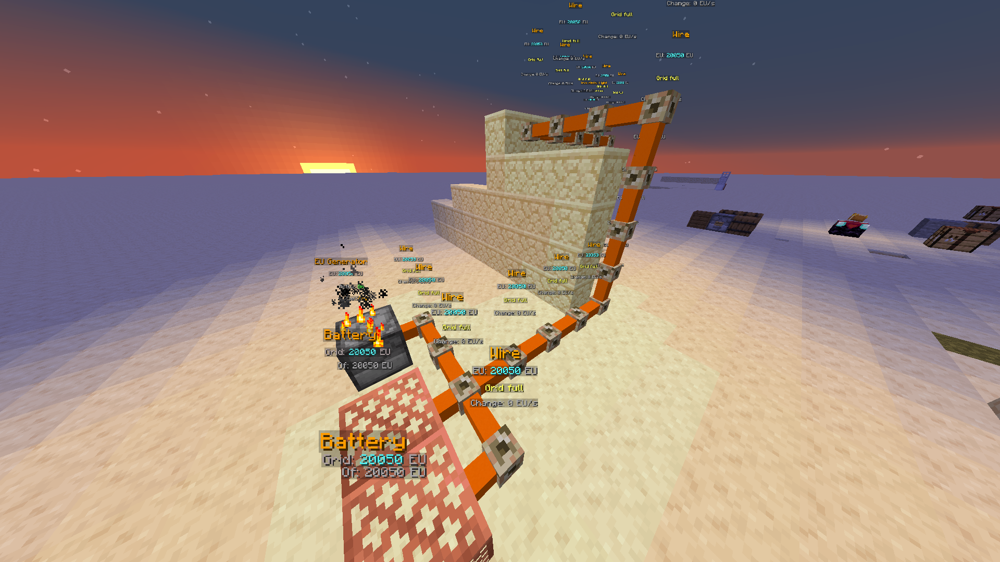
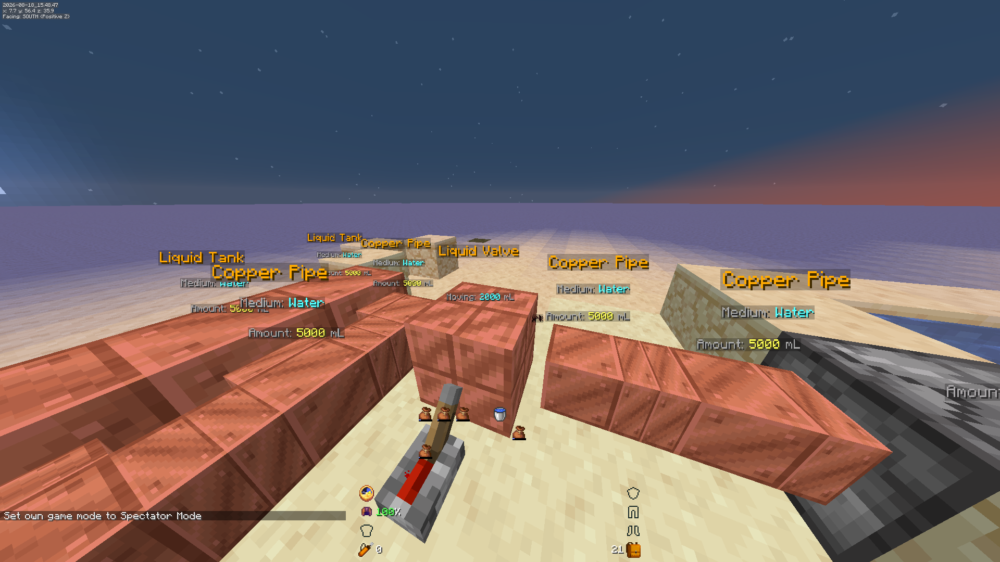
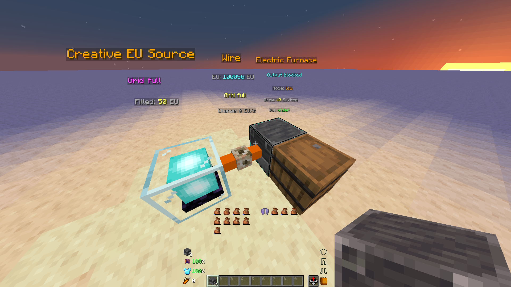
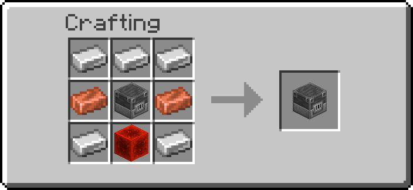
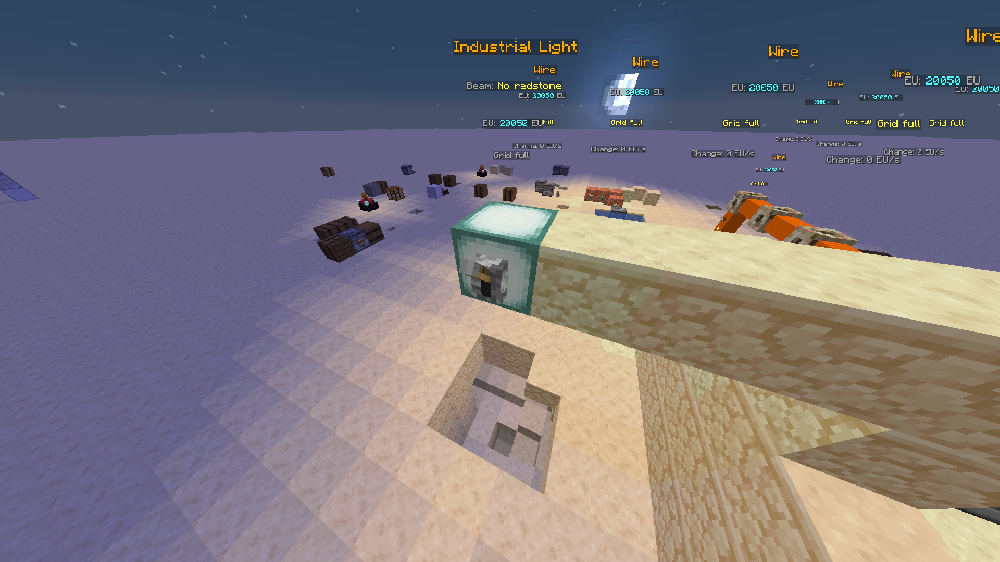
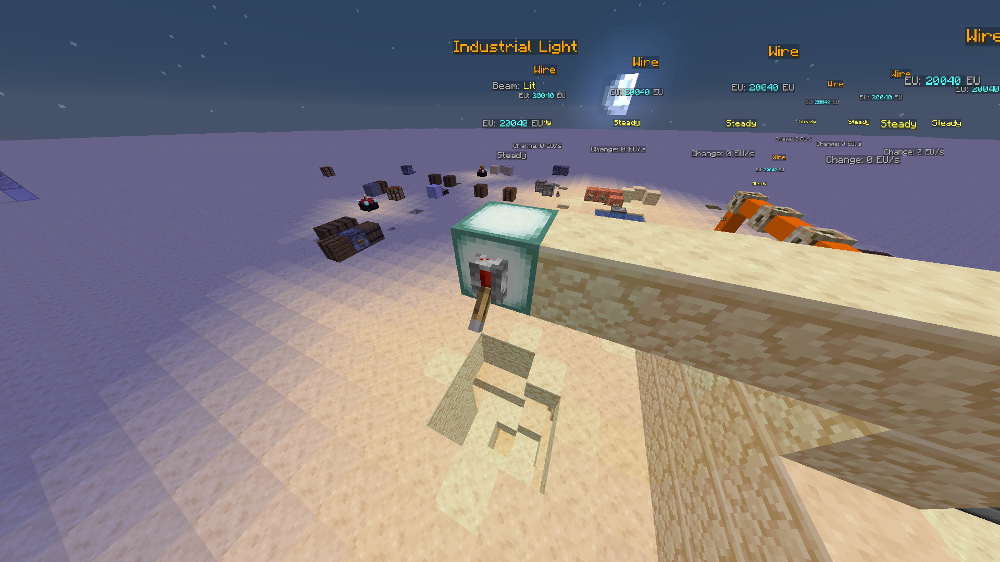

# Transport Networks

The `ra_wires` module adds liquid, gas, and EU transport.

- Namespace: `ra_wires`
- Get the blocks: the **Wires Bundle** (`/function ra:items/bundles/give_wires_bundle`)
- Creative-only sources: `/function ra_wires:items/give_creative`
- Runtime architecture: [How It Works](how-it-works.md)




*An EU grid: generator, wire, battery and consumers, with the goggles reporting
what each one holds and whether the grid is gaining or losing.*

## Block Families

| Family | Blocks | Notes |
|---|---|---|
| Fluid | Copper Pipe, Liquid Tank, Liquid Pump, Liquid Valve, Liquid Drain | Liquids and gases share one pipe network |
| Gas | Gas Tank, Gas Pump, Gas Valve, Boiler | Gases use the same pipes as liquids |
| Electric | Wire, EU Generator, EU Consumer, EU Switch, EU Breaker, Battery, Solar Panel, Industrial Light, Electric Furnace | Grid-wide EU: batteries store it, breakers bridge grids |

## Flow Model

**Contents belong to the network, not to individual blocks — fluids and EU alike.**

Electric used to be the exception: every wire held its own charge and, once a
tick, handed half the difference to one neighbour that had less. That model
levels charge out, it does not deliver it. Charge crawled one block per tick, a
generator with six neighbours fed exactly one of them, and once a run had evened
out to within 1 EU everywhere the transfer guard stopped it moving at all, so a
consumer at the end of a line was fed by whatever leaked past the wires in front
of it. Electric now runs on the same engine as fluids, and everything below
applies to it word for word.

A connected run of pipes, tanks, pumps, valves and drains is one *network* with a
single medium, a single amount and a capacity equal to the sum of its members.
Adding a pipe adds capacity; it does not add another buffer that fluid has to be
pushed through.

That means:

- Nothing travels. Anything a pump or a generator adds is immediately available
  to every drain or consumer on the same network, however far away, on the same
  tick.
- Pipes, tanks, valves, wires and switches do **no** per-tick work. Only the
  blocks that move something between the world and the network are ticked —
  pumps, drains, boilers, generators, solar panels, consumers. A hundred-block
  run is free to keep running.
- Network membership is recomputed only when a node is placed or broken, and is
  debounced so laying a long run costs one rebuild rather than one per block.

Network state:

- `data.properties.*` — configuration the player can change (`mode`, `rate`, `cooldown`).
- `data.status.*` — read-only values for goggles, redrawn once a second.

## Capacity is Storage, and Storage is Finite

A network holds exactly what its members can store, and nothing carries a hidden
buffer. Fluids are measured in **millilitres**; a bucket is 5000 mL.

| Block | Holds |
|---|---|
| Pipe (either tier) | 1000 mL |
| Pump, Drain | 2000 mL |
| Tank | 100000 mL (20 buckets) |
| Wire, EU Switch, EU Breaker | **0 EU** |
| EU Generator, Consumer, Solar Panel | 50 EU |
| **Battery** | 10000 EU |

Network totals live in `storage ra:transport nets.n<id>` rather than on a
scoreboard fake player. A scoreboard gives one number per network, which is
exactly the shape that has to change when a network can hold several media at
once; a compound already has room for the per-medium map. Arithmetic still goes
through scoreboards, because commands have no other way to add two numbers.

Wire stores nothing. A grid with no battery on it holds only the small working
buffers of its generators and consumers, so whatever is generated has to be spent
on the same tick or it is lost — build batteries or waste your output. This is
the electric answer to "a pipe adds a litre": a run of wire is not secretly a
tank.

A world source block pumps in as 5000 mL. A cauldron gives up its bucket across
its three levels, 1667 + 1667 + 1666. The Boiler trades 1000 mL of water for
1000 mL of steam per cycle.

## Media

Each medium carries its own colour and particle, so water splashes, lava sparks
and experience glows rather than everything emitting the same grey smoke.

Registered: water, lava, powder snow, milk, **experience**, **potion**, steam,
smoke, oxygen.

**One experience point is 100 mL**, and the rate is the same in both directions —
what a player pours into a drain is exactly what a drain set to *place* gives
back, as orbs.

!!! warning "One medium at a time, still"
    A network holds a single medium until it is emptied. `potion` is therefore one
    medium covering every variety: a network cannot yet tell a healing potion from
    a swiftness one. Filters wait on the same change.

## The Drain's Three Roles

Two are set with the wrench: **drain** takes a world source into the
network, **place** spends network contents putting a source block back.

The third is decided by how you place the block. Stood **vertically** it stops
working on the world entirely and becomes the **loading point**, taking filled
containers in from three places, tried in that order:

1. **A sneaking player's main hand.** The empty is left in your hand.
2. **A container on top of the drain.** The empty goes back into that container,
   or is dropped if it no longer fits.
3. **Loose items on top of the drain.** The empty is dropped.

Only the first needs sneaking, because a bucket is also how you pick fluid *up* —
without that gate, walking past with a full bucket would quietly empty it. A
bucket you have deliberately put in a barrel or dropped on the block is not
ambiguous in that way, and running unattended is the point of those two: a hopper
feeding buckets into a barrel over a drain is how a base loads a network with
nobody standing there.

One container per cycle, whichever route it came from, so the drain's `cooldown`
still governs throughput.

With **nothing** it recognises anywhere, it takes a sneaking player's
**experience** instead: ten points a cycle, 100 mL each, whole points only.

The network is charged before the swap, and only if it can take the whole
container. There is no such item as a part-full bucket.

## Throughput

The wrench cycles three steps on the two blocks whose whole job is a rate:

| Block | Steps |
|---|---|
| Liquid Drain | 2.5 / **5** / 10 L per second |
| EU Consumer | 20 / **40** / 80 EU per tick |

A consumer takes all or nothing, so the heavy setting simply idles on a grid that
cannot cover it — that is how you decide what a base spends its generation on.

## Bridges

A **bridge** belongs to neither of the networks it sits between, and that is what
makes it work: a node belongs to exactly one network, so anything that joined
would merge the two sides and leave nothing to bridge. The Boiler has always
worked this way. A bridge also breaks connectivity by existing — a pipe run with
a valve in it is two networks, always.

While powered by redstone, a bridge **evens the two networks out**: it takes from
whichever side holds more and gives it to whichever holds less, up to its `rate`
per tick, and stops when they are level.

**It has no facing.** It looks at all six neighbours, finds the networks touching
it, and moves from the fullest to the emptiest. Drop it into a pipe run any way
round and it works — there is nothing to get wrong and nothing to line up.

It cannot oscillate: the amount moved is capped at the difference between the two
sides, so the most that can happen is that they end up level, and once level
neither direction fires.

- **Liquid Valve / Gas Valve** — the fluid bridge. Carries the medium across, and
  refuses if the far side holds something different.
- **EU Breaker** — the same block for grids. Two bases with their own batteries
  share what they have through one.
- **Ender Power Vault** — a *wireless* bridge. It joins its local grid so wires
  connect to it, contributes no capacity, and moves EU to the vault on its channel
  — out of the grid at this end and into the grid at the far end. Whatever the far
  grid cannot accept is put straight back.

!!! warning "The Valve changed meaning"
    The Valve used to be a shutoff that cut a line by leaving its network. It is
    now a two-way link between two networks and needs redstone to do anything. An
    existing build using a valve as a closed tap will find it does not conduct at
    all until powered. To cut a fluid line now, remove a pipe.

Pipes, tanks and wires carry no configuration at all — they are pure conductors and
capacity. The **EU Switch** is still a true shutoff: it leaves its network when
turned off, so the two halves genuinely become separate grids.

## Media

Media are named, not numbered:

| Key | Name | State | World block |
|---|---|---|---|
| `water` | Water | liquid | `minecraft:water` |
| `lava` | Lava | liquid | `minecraft:lava` |
| `powder_snow` | Powder Snow | liquid | `minecraft:powder_snow` |
| `milk` | Milk | liquid | — |
| `steam` | Steam | gas | — |
| `smoke` | Smoke | gas | — |
| `oxygen` | Oxygen | gas | — |

A network holds one medium at a time. It forgets its medium when drained to
empty, so a different one can be pumped in without breaking anything.

## Pumps and Drains

**Liquid Pump** — pulls a world fluid source into the network. It checks all six
adjacent blocks, so it works whichever way you place it. A source block is
all-or-nothing: the pump only takes it if the whole 1000 units fit, so a nearly
full network cannot delete a lake a partial bucket at a time.

**Liquid Drain** has two modes, cycled from the wrench menu:

- `drain` — takes a world source into the network (like a pump, on a slower cycle).
- `place` — spends 1000 units putting a source block of the network's medium back
  into the world, on the first free side.

`place` mode is what makes a network worth building: carry lava from a pool to
wherever you want it, or refill cauldrons across a base.

### Infinite Sources

A body of **nine or more** matching source blocks within two blocks of the one
being taken counts as inexhaustible, and the block is left alone. Anything
smaller is genuinely consumed, so small pools empty out.

## Boiler and the EU Chain

The Boiler sits **between two networks** — it is deliberately not a member of
either, because a network holds one medium and it needs water on one side and
steam on the other.

```text
water network → [Boiler over a heat source] → steam network → [EU Generator] → EU
```

- Any block in `#ra_wires:heat_sources` under the Boiler will do: lava, fire,
  soul fire, magma block, campfire, soul campfire, lava cauldron.
- Consumes 100 water and produces 100 steam per cycle.
- The **EU Generator burns steam**, or solid fuel dropped straight into it — it
  is a barrel wearing a furnace skin, so loading it is just putting coal in a box.
  Either way it does not generate power from nothing.
- The **Solar Panel** generates EU from sky light instead, scaling with the
  vanilla daylight detector's own light reading — so night, rain, roofs and snow
  cover all reduce it automatically.

## Valves

A valve genuinely **splits the network in two**. The halves
then hold separate contents and separate media. Closing a valve is the supported
way to isolate part of a system.

The state is set with redstone; either way
the network follows.

## Visual Connectivity

Each node draws only **its own half** of a connection — from its core out to its
block boundary, never across into the neighbour. Displays are rebuilt only when a
conduit appears or disappears at a marker, never on a tick where nothing changed.

Fluid pipes render as a chunky 0.56 core in copper or iron. Electric wires are
deliberately thinner (0.26) and use concrete, so the two are easy to tell apart
at a glance.

## Goggles and Tinkering

Goggles show medium, amount, and per-block state lines.

Tinkering — sneak and hold goggles in the main hand near a node:

- Most nodes: nothing to cycle — the wrench says so.
- Drain: cycle mode between `drain` and `place`.

Pumps have nothing to configure; they take whatever they find next to them.

## Extending New Media

1. Add an entry to the registry in `ra_wires:media/init` — display name, state,
   colour, particle, and optionally a world block and bucket.
2. If it can be pumped out of the world, add a `source_blocks` entry naming the
   block state, the medium, the volume, and what the block becomes when drained.

That is all. Nothing else needs a per-medium branch.

---



*A fluid network in millilitres. Contents live on the network, not in the pipes —
a pipe only adds capacity.*

## Electric Furnace



Smelts using EU instead of fuel. There is no fuel slot, because there is no fuel.

{ width="260" }

| Mode | Ticks per item | EU per item | EU per tick |
| --- | --- | --- | --- |
| low | 100 | 40 | 0.4 |
| medium | 50 | 80 | 1.6 |
| high | 20 | 160 | 8 |
| superpowered | 5 | 300 | 60 |

Cycle the mode with the wrench. EU per item rises faster than speed does on
purpose: four times quicker for four times the power would leave no reason to
run anything but superpowered, and "low" would never be a real choice on a small
grid.

The scale is anchored on the generators the pack ships. One **EU Generator**
makes 60 EU/t, so superpowered is one generator running flat out. A **Solar
Panel** peaks at 50 EU/t, so it is a couple of panels at noon, or a handful plus
a **Battery** to carry the night. Low is still 7.5x cheaper per item than
superpowered, which is what keeps it worth using for bulk smelting.

### How input and output are split

**Input** is the furnace's own barrel — any smeltable stack, any slot.

**Output** is pushed into the container on one chosen face: **under**, **front**,
**back** or **top**, chosen from the [wrench menu](tools.md#wrench). The power mode is in the
wrench menu as well — shift+RMB lists Output, Power and Enabled together.

Results never come back into the furnace. That is what stops it smelting its own
output — cobblestone would otherwise become stone and then smooth stone — and it
means there is no slot rule for anyone to remember. Feed it with a hopper from
any side; take from the destination container with anything at all.

If the destination is missing or full the furnace stops and the goggles read
`Output blocked`. That is checked *before* any EU is spent and before the input
is consumed, so a blocked output costs nothing and destroys nothing.

### What it can smelt

The recipe table is hand-maintained (`ra_wires:blocks/electric_furnace/init_recipes`),
because a data pack cannot ask the game what a vanilla smelting recipe produces.
It covers ores and raw metals, iron and gold gear back to nuggets, food, sand,
clay, stone, cracked bricks and logs to charcoal. Anything not in the table is
left alone.

## Industrial Light

Redstone **and** EU, projecting a ten-block beam of real `minecraft:light`. It
stops at the first solid block, and the only block it will ever remove is a light
of the exact level it places.

| Unpowered | Lit |
|---|---|
|  |  |

The goggles name whichever condition is missing — `No redstone` or `No EU` —
rather than a bare "Dark".

## Creative sources

Two blocks that make something from nothing, for building and testing the
consuming half of a system without also running a fuel farm or a pump farm to
feed it. Neither has a recipe. Both are in the **Wires Bundle** with the rest of the
module, or `/function ra_wires:items/give_creative` for just the two.

| Block | Real block | What it does |
| --- | --- | --- |
| Creative EU Source | `minecraft:beacon` | Refills its grid to capacity every tick |
| Creative Fluid Source | `minecraft:beacon` | Fills its network with one medium, cycled with the wrench |

The EU source fills to capacity rather than producing a fixed rate, so it does
not matter how much the grid draws: whatever was spent last tick is back this
tick and a machine on a creative grid never sees a brownout.

The fluid source's medium is a property rather than a fixed choice because a
fluid network holds exactly one medium at a time — a source stuck on water could
not be used to test a lava line at all. If the network already holds something
else the offer is refused and the goggles say so, which is correct behaviour
rather than a fault.
