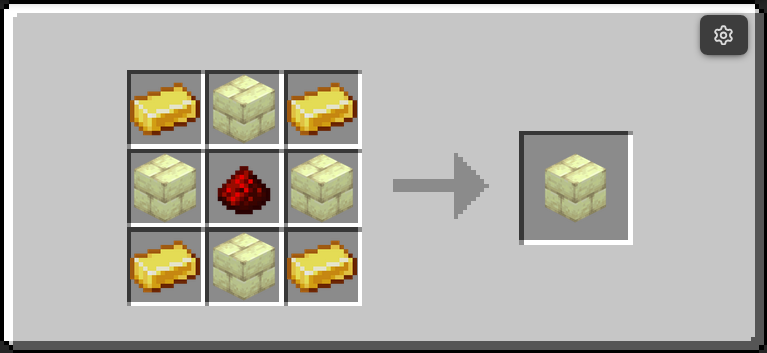
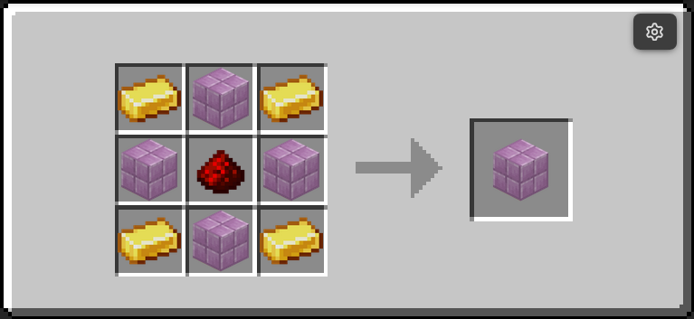
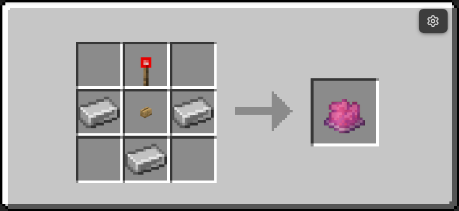

# Wireless Redstone

The `ra_wireless` module links emitters, receivers, and the handheld remote through channel strings.

- Namespace: `ra_wireless`
- Give all: `/function ra_wireless:items/give_all`
- Runtime architecture: [How It Works](how-it-works.md)

## Crafting Overview

| Item | Recipe preview | Runtime role |
|---|---|---|
| Wireless Emitter | { width="240" } | Sends signal while powered |
| Wireless Receiver | { width="240" } | Outputs redstone when matching emitter is active |
| Redstone Remote | { width="240" } | Pulses matching receivers from your hand |

## Two-Minute Setup

1. Place one Emitter and one Receiver.
2. Set both to the same channel string (for example `main`).
3. Power the Emitter with redstone.
4. Receiver outputs while a matching Emitter is transmitting.
5. Optionally use the Remote for short wireless pulses.

## Channel Model

Channels are string identifiers (default is `"default"`). Matching uses exact string equality.

- Emitter property: `data.properties.channel`
- Receiver property: `data.properties.channel`
- Remote item channel: `SelectedItem.components.minecraft:custom_data.ra.channel`

## Command Quick Reference

| Command | Purpose |
|---|---|
| `/function ra_wireless:items/give_all` | Give emitter, receiver, and remote |
| `/function ra_wireless:tools/remote/give` | Give remote only |
| `/function ra_wireless:tools/remote/set_channel {channel:"main"}` | Set current remote channel |

## Runtime Behavior

### Wireless Emitter

1. Runs `ra_lib:redstone/detect` and reads aggregate power from `ra.power`.
2. If `enabled=1b` and powered, adds `ra.transmitting`.
3. If unpowered, removes `ra.transmitting`.

### Wireless Receiver

1. If disabled, output is forced off.
2. If tagged `ra.pulsing`, output stays on while `ra.pulse_timer` counts down.
3. If not pulsing, it scans transmitters for exact channel match.
4. Output shell turns on only when a valid source exists.

### Redstone Remote

- Right-click: pulse matching receivers.
- Sneak + right-click: opens a channel prompt (`suggest_command`) for `/function ra_wireless:tools/remote/set_channel {channel:"..."}`.
- Pulse length: 4 ticks (`ra.pulsing` + `ra.pulse_timer`).

## Troubleshooting

- Receiver does not output: verify emitter and receiver channel strings are identical.
- Remote does nothing: verify remote channel matches receiver channel exactly.
- Constant output when not expected: check whether any emitter on that channel is still powered.

## Contributor Notes

1. Channels are strings, not numeric IDs.
2. Keep emitter and receiver channel comparisons exact.
3. Channel UX changes must update both block properties and remote item custom data logic.

---
